# Wojo's Uno Q Face Outline Demo

[](https://docs.arduino.cc/hardware/uno-q/)
[](https://www.qualcomm.com/products/technology/processors)
[](https://ai.google.dev/edge/mediapipe/solutions/vision/face_landmarker)
[](https://docs.arduino.cc/software/app-lab/)
[](LICENSE)

**2026 Wojo's Uno Q Face Outline Demo V1**

A real-time face tracking demo built for the [Arduino Uno Q](https://docs.arduino.cc/hardware/uno-q/) -- a dual-processor board that pairs a Qualcomm QRB2210 application processor running Debian Linux with a dedicated STM32U585 microcontroller running Arduino sketches on Zephyr OS. The two processors communicate over a built-in RPC bridge, managed through [Arduino App Lab](https://docs.arduino.cc/software/app-lab/) and the [Bricks SDK](https://docs.arduino.cc/software/app-lab/tutorials/bricks).

Face detection (478 landmarks, up to 4 faces) provides the AI workload that exercises the full pipeline: browser-side inference via MediaPipe, WebSocket telemetry to a Python coordinator on Debian, Bridge RPC forwarding to the STM32 MCU, and physical feedback through the built-in 13x8 LED matrix and RGB LED. The inference source is deliberately swappable -- the architecture is the showcase.

---

## Why the Arduino Uno Q

The [Arduino Uno Q](https://docs.arduino.cc/hardware/uno-q/) is not a typical Arduino. It is a single-board computer with an embedded MCU, designed for AI at the edge.


The QRB2210 MPU provides quad-core Cortex-A53 at 2.0 GHz, an Adreno 702 GPU, dual ISPs for camera input, Wi-Fi 5, Bluetooth 5.1, and 2 GB or 4 GB of LPDDR4 RAM. The STM32U585 MCU provides Cortex-M33 at 160 MHz with 2 MB flash and 786 KB SRAM, running deterministic real-time control. The two processors communicate through a built-in RPC library called Arduino Bridge.

This demo exercises all of it. The MPU runs a Python coordinator and serves a web app through the `arduino:web_ui` Brick. The browser performs face detection and sends results back over WebSocket. Python receives those results and forwards them to the MCU via Bridge RPC. The MCU drives the LED matrix and RGB LED to give physical feedback -- all at real-time priority on Zephyr OS.


For full pinout details, datasheet, schematics, and CAD files, see the [official hardware page](https://docs.arduino.cc/hardware/uno-q/) and the [UNO Q User Manual](https://docs.arduino.cc/tutorials/uno-q/user-manual/).

---

## What This Demo Showcases

### The Uno Q + App Lab pipeline

The core of this demo is the Uno Q's dual-processor architecture working end-to-end through App Lab:

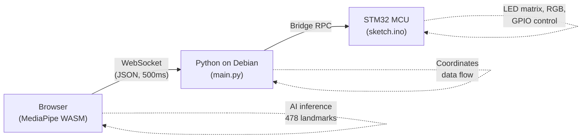

Debian Linux and an STM32 are on the same Uno-hat-compatible PCB, communicating over a built-in RPC bridge, managed through App Lab and Bricks. The demo uses face detection as the AI workload, but the architecture -- Python coordinator, Bridge providers, MCU actuation, WebSocket telemetry, App Lab deployment -- is the same pattern you would use for object detection, sensor fusion, safety monitoring, or any other edge AI task.

### App Lab Bricks -- the Uno Q-native way to build

The `arduino:web_ui` Brick powers this demo. It serves HTML/JS from `assets/`, provides WebSocket messaging between the browser and Python, and requires zero configuration beyond one line in `app.yaml`.

| Brick                         | What it does                          | Model              | Setup                          |
|-------------------------------|---------------------------------------|--------------------|---------------------------------|
| `arduino:web_ui`              | Serves web content + WebSocket        | (no AI model)      | **This demo uses it**           |
| `arduino:object_detection`    | Detects objects in camera frames      | YOLOX-Nano         | Add one line to `app.yaml`      |
| `arduino:motion_detection`    | Detects motion in video stream        | Frame differencing  | Add one line to `app.yaml`      |

To add a Brick, edit `app.yaml`:

```yaml
bricks:
  - arduino:web_ui
  - arduino:object_detection
```

Each Brick deploys as a container on the QRB2210 and exposes an API to your Python code.

### About the face detection inference source

This demo uses Google MediaPipe Face Landmarker running in the browser -- not on the Uno Q's MPU. It was chosen because it provides zero-setup 478-point face landmarks that exercise the full pipeline without requiring model compilation, camera drivers, or additional Python dependencies.

The inference source is deliberately swappable. The Python coordinator, Bridge providers, sketch, and MCU actuation layer do not depend on MediaPipe. Replace the browser-side face data with an App Lab Brick, an AI Hub TFLite model, or a custom Edge Impulse model -- the MCU layer and App Lab workflow stay the same. That modularity is the architectural point of this demo.

---

## Architecture

### System Overview

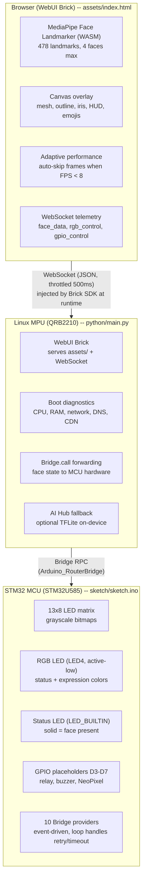

### Compute Architecture: What Runs Where

The Uno Q has four distinct compute blocks:


| Block    | Silicon                          | Clock    | Role in this demo                                                                                   |
|----------|----------------------------------|----------|------------------------------------------------------------------------------------------------------|
| **CPU**  | Quad-core Arm Cortex-A53 (Kryo)  | 2.0 GHz  | Runs Debian Linux, Python coordinator, Docker containers for App Lab Bricks, and the Chromium browser |
| **GPU**  | Qualcomm Adreno 702              | 845 MHz  | OpenGL ES 3.1, Vulkan 1.1, OpenCL 2.0. Available for WebGL rendering and TFLite GPU delegate         |
| **DSP**  | Dual-core Qualcomm Hexagon       | --       | Audio signal processing and always-on low-power tasks. Not used by this demo                         |
| **MCU**  | STM32U585 Arm Cortex-M33         | 160 MHz  | Runs Arduino sketch on Zephyr OS. Drives LED matrix, RGB LED, status LED, and GPIO. Purely real-time I/O |

The QRB2210 has **no dedicated TPU or NPU** (no TOPS rating). AI inference relies on the CPU and GPU through framework runtimes like TFLite and WASM. This is an intentional tradeoff -- the QRB2210 is Qualcomm's entry-tier IoT processor, optimized for low power and cost. For NPU-accelerated inference, Qualcomm's higher-tier processors (QCS6490, QCS8550) include the Hexagon Tensor Processor, but those are not available in the UNO form factor today.

The inference source is swappable. The same Python coordinator, Bridge providers, and MCU sketch work with any AI input -- App Lab Bricks, TFLite models on the MPU, or custom models.

---

## Quick Start

### Hardware Requirements

| Component    | Details                                                                                                                    |
|--------------|-----------------------------------------------------------------------------------------------------------------------------|
| Board        | [Arduino Uno Q](https://store.arduino.cc/pages/uno-q) (QRB2210 + STM32U585, 2 GB or 4 GB)                                  |
| LED Matrix   | Built-in 13x8 (no wiring needed)                                                                                           |
| Camera       | Standard UVC USB webcam                                                                                                     |
| Connection   | [USB-C multiport adapter](https://store.arduino.cc/products/usb-c-to-hdmi-multiport-adapter-with-ethernet-and-usb-hub) with external power delivery |
| Browser      | Chrome or Edge on any device on the same network                                                                            |

The board can be powered via USB-C (5V 3A), the 5V pin, or VIN (7-24V):


### Installation

App Lab runs in two modes: directly on the Uno Q as a single-board computer (SBC mode, recommended with the 4 GB variant), or hosted on your PC with the board connected via USB-C.


Download this repository as a `.zip`. Open [Arduino App Lab](https://www.arduino.cc/en/software/#app-lab-section) (pre-installed on the Uno Q in SBC mode, or install the desktop version on your PC). Click Import App and select the `.zip`. App Lab reads `app.yaml`, compiles the sketch for the STM32 MCU, deploys the WebUI Brick, and launches the application. The LED matrix will display the board's IP address -- open it in Chrome on any device on the same Wi-Fi network.

For manual setup without App Lab: clone this repo to the Uno Q, flash `sketch/sketch.ino` via Arduino IDE 2+, ensure the Bricks SDK is installed, and run `python/main.py` on the Linux side.

### First-Time Setup on a Fresh Board

If this is a brand-new Uno Q that has never been connected to App Lab before, expect several update prompts before the demo runs.

<details>
<summary><strong>What App Lab will prompt you to update (and what to do)</strong></summary>

| Prompt                        | What it updates                                          | Recommended action | What happens if you skip                                    |
|-------------------------------|----------------------------------------------------------|--------------------|--------------------------------------------------------------|
| System firmware               | Linux OS image on the QRB2210 MPU                        | **Accept**         | Risk kernel/driver incompatibilities with the WebUI Brick    |
| Arduino board core (Zephyr)   | Zephyr RTOS platform for STM32 MCU sketches              | **Accept**         | Sketch compilation will likely fail if core is too old        |
| Board firmware (STM32 bootloader) | Low-level MCU bootloader                             | **Accept**         | Bridge.begin() may hang or fail silently                     |
| Brick container updates       | Docker images for WebUI Brick and App Lab services       | **Accept**         | Demo cannot start without the WebUI Brick container          |

</details>

**After accepting all updates:**

1. The board will reboot (possibly more than once). Wait for the green power LED to stabilize -- this can take 60-90 seconds on first boot after a firmware update.
2. Connect the board to Wi-Fi if not already configured (App Lab > Settings > Network). The demo requires internet access to download MediaPipe (~4 MB) from cdn.jsdelivr.net on first load. After the first successful load, the browser caches the WASM engine and model.
3. Import the demo `.zip` and let App Lab compile the sketch. Compilation takes ~30-60 seconds. The LED matrix will show a boot icon, then a checkmark, then scroll the board's IP address.
4. Open the displayed IP address in Chrome on any device on the same Wi-Fi network.

<details>
<summary><strong>Troubleshooting</strong></summary>

| Symptom | Likely Cause | Fix |
|---------|-------------|-----|
| Blank screen, no error | JavaScript module failed to load | Open browser console (F12), check network errors. Usually cdn.jsdelivr.net unreachable -- check Wi-Fi |
| "Cannot Load Face Detection Engine" overlay | No internet | Connect to Wi-Fi and hit the Retry button |
| LED matrix stays on boot icon | Bridge.begin() stuck due to core/firmware mismatch | Accept all pending updates in App Lab, re-import |
| "No Camera Detected" overlay | No USB webcam plugged in | Plug a USB webcam into any USB-A port. MIPI-CSI requires the Media Carrier board |
| Camera permission denied | Browser blocking camera access | Check browser settings > Site permissions > Camera > Allow |
| MCU shows red LED, Python says "MCU ready" | Normal behavior | MCU starts red (idle). Turns green when first face is detected |
| Sketch won't compile | Outdated board core | Ensure `arduino:zephyr` is installed and up to date |

</details>

<details>
<summary><strong>Recovery if you declined updates</strong></summary>

If you said "No" to one or more update prompts and the demo doesn't work:
1. Open App Lab settings
2. Check for board/firmware/core updates
3. Accept all pending updates
4. Reboot the board
5. Re-import the demo `.zip`

The MCU sketch includes an acknowledgement-driven retry mechanism -- it re-sends `mcu_ready` every 3 seconds for up to 3 minutes after boot. Once the MPU receives the signal, it dispatches `mpu_ack` from a background thread (to avoid deadlocking the Bridge read loop), and the MCU stops retrying. The Bridge connection establishes automatically as soon as both sides are ready.

</details>

---

## Project Structure

```
app.yaml                  App Lab manifest (bricks: arduino:web_ui)
python/
  main.py                 MPU entry -- WebUI Brick + Bridge forwarding
  face_detector_mpu.py    On-device TFLite face detection wrapper
  ai_hub_setup.py         AI Hub model download/compile helper
  models/                 .tflite model files (auto-discovered at boot)
  requirements.txt        Python dependencies (none beyond App Lab SDK)
sketch/
  sketch.ino              MCU entry -- Bridge.provide() + LED matrix
  sketch.yaml             Arduino CLI board profile and library versions
assets/
  index.html              Face tracking frontend (references css/ and js/)
  css/styles.css          Extracted stylesheet
  js/app.js               Extracted application logic (ES module)
  qualcomm-logo.png       Qualcomm branding asset
app.py                    Replit-only Flask server (excluded via .gitignore)
templates/                Replit copy of assets/ (index.html, css/, js/)
static/                   Replit static assets
```

---

## State Diagrams

### 1. Full System Boot Sequence

Both processors boot in parallel. The MCU completes first (no OS) and waits for Bridge; the MPU runs Linux, starts Python, then connects.

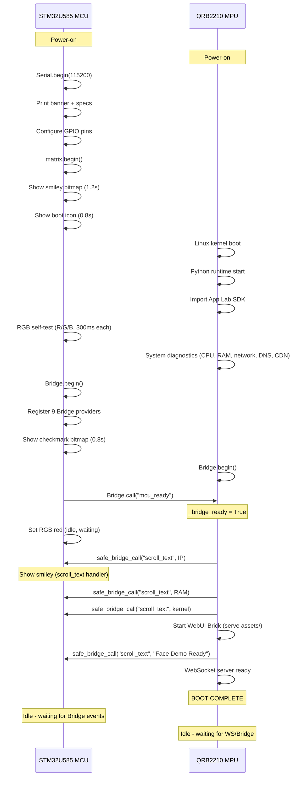

> **Note:** The scrollText MCU handler currently displays `frame_smiley` rather than scrolling text -- text scrolling requires ArduinoGraphics font rendering which is not yet implemented for the Zephyr platform.

### 2. Camera Initialization Flow

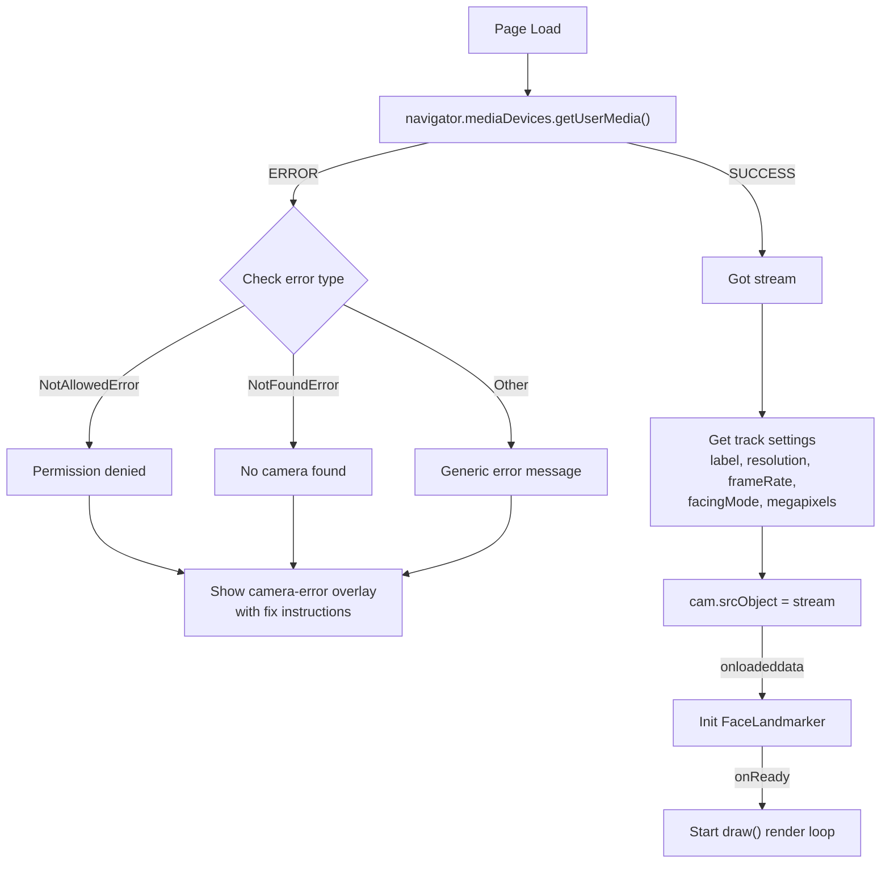

<details>
<summary><strong>3. Face Detection and Rendering Pipeline</strong></summary>

Every animation frame passes through this pipeline. The adaptive performance system may skip frames to maintain smooth rendering.

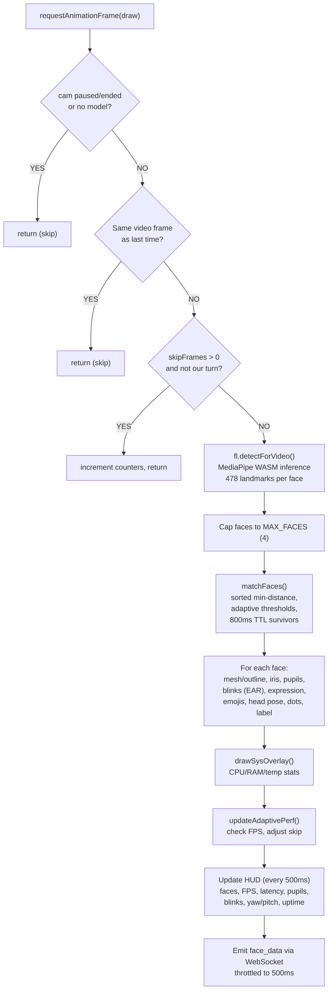

</details>

<details>
<summary><strong>4. Adaptive Performance State Machine</strong></summary>

Monitors FPS over a sliding window and auto-adjusts frame skipping. Hysteresis gap (8 to 14) prevents rapid toggling.

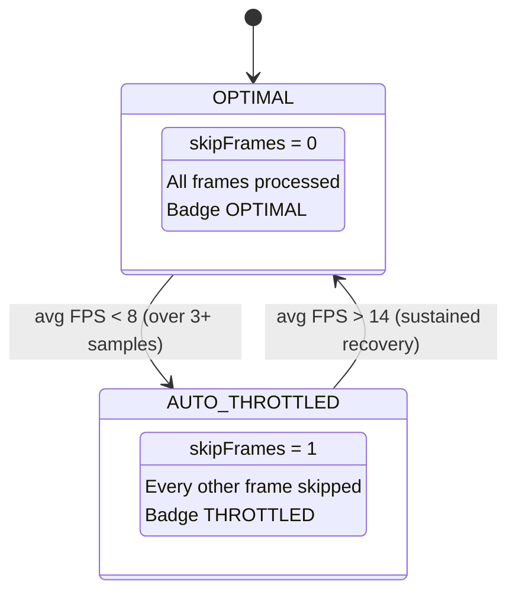

| Parameter          | Value      |
|--------------------|------------|
| lowFpsThreshold    | 8 FPS      |
| highFpsThreshold   | 14 FPS     |
| fpsWindowSize      | 5 samples  |
| checkInterval      | 2000ms     |
| Min samples needed | 3          |

</details>

<details>
<summary><strong>5. Face Tracking Lifecycle</strong></summary>

Each detected face gets a persistent monotonic ID (never recycled) and a unique color from a 4-color palette (blue, orange, green, purple).

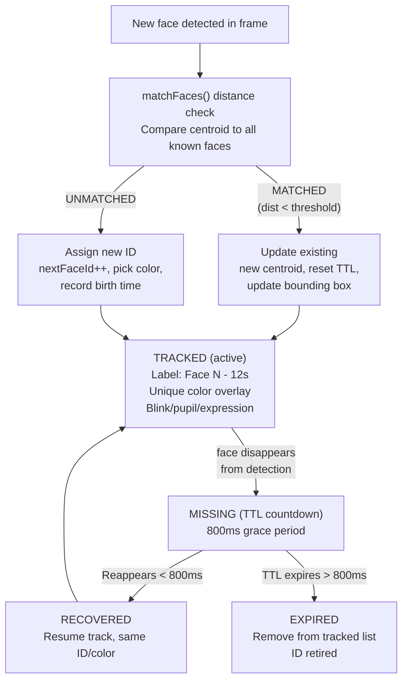

Distance matching: threshold scales with face width, sorted by global minimum distance, greedy assignment (closest pair first). Max tracked faces: 4 (MAX_FACES).

</details>

### 6. Bridge Communication Flow

Three layers communicate via two protocols: WebSocket (browser to MPU, injected by the Brick SDK at runtime) and Bridge RPC (MPU to MCU). In the Replit preview, the browser runs standalone without the SDK, so face detection and rendering work but no data reaches the MPU or MCU.

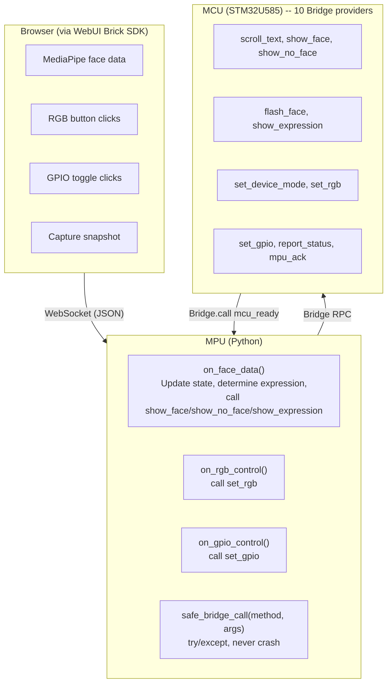

**MCU Bridge Providers:**

| Provider             | Action                                                  |
|----------------------|----------------------------------------------------------|
| `scroll_text(text)`  | Display `frame_smiley` (no text scroll on Zephyr)        |
| `show_face()`        | Smiley bitmap + green RGB + relay ON                     |
| `show_no_face()`     | X bitmap + red RGB + relay OFF                           |
| `flash_face(count)`  | Rapid flash N times + buzzer beep                        |
| `show_expression(e)` | Expression bitmap + color-coded RGB                      |
| `set_device_mode(m)` | Store mode string (no hardware change)                   |
| `set_rgb(color)`     | Set RGB LED (8 colors + off)                             |
| `set_gpio(pin:state)`| Toggle pin if in allowlist and enabled                   |
| `report_status()`    | Send uptime/faces/mode to MPU                            |
| `mpu_ack()`          | Acknowledge MPU handshake, stop retry loop                |

<details>
<summary><strong>7. RGB LED State Machine</strong></summary>

LED4 is active-low (LOW = ON, HIGH = OFF). Supported colors: red, green, blue, yellow, cyan, magenta, white, off.

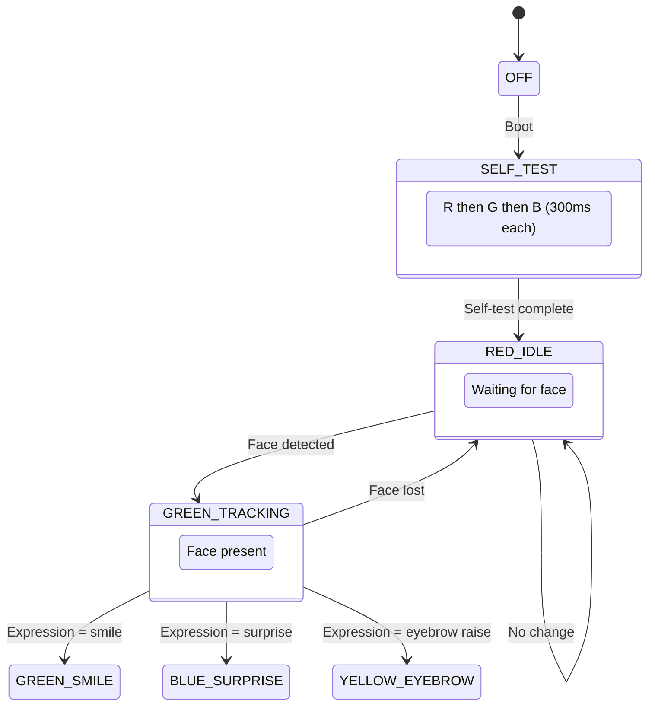

</details>

<details>
<summary><strong>8. Overlay Rendering Order</strong></summary>

Each frame draws layers in a specific order. The overlay preset controls which layers are visible.

| Layer | Content                          | Visibility        |
|-------|----------------------------------|--------------------|
| 0     | Video frame (via cam element)    | Always             |
| 1     | Face mesh tessellation           | Toggleable         |
| 2     | Face contour / jawline           | Toggleable         |
| 3     | Eye outline connections          | Toggleable         |
| 4     | Eyebrow connections              | Toggleable         |
| 5     | Lip connections                  | Toggleable         |
| 6     | Face oval (outer contour)        | Toggleable         |
| 7     | Iris connections + pupil ring    | Toggleable         |
| 8     | Iris diameter measurement        | Always (when iris visible) |
| 9     | Landmark dots (478 per face)     | Toggleable         |
| 10    | Emoji expression indicators      | Toggleable         |
| 11    | Blink flash (hot pink)           | Triggered on blink |
| 12    | Face label ("Face N -- 12s")     | Always             |
| 13    | System stats overlay             | Always (top-right) |
| 14    | HUD ticker                       | Always (bottom-center) |

**Overlay Presets:**

| Preset              | Mesh | Outline | Eyes | Brows | Lips | Iris | Dots | Emoji |
|---------------------|:----:|:-------:|:----:|:-----:|:----:|:----:|:----:|:-----:|
| Full Mesh+Features  | Y    | Y       | Y    | Y     | Y    | Y    | Y    | Y     |
| Outline+Features    | -    | Y       | Y    | Y     | Y    | Y    | -    | Y     |
| Mesh Only           | Y    | -       | -    | -     | -    | -    | -    | -     |
| Dots Only           | -    | -       | -    | -     | -    | -    | Y    | -     |
| Minimal             | -    | Y       | -    | -     | -    | Y    | -    | -     |
| Outline+Emojis      | -    | Y       | -    | -     | Y    | -    | -    | Y     |

</details>

<details>
<summary><strong>9. Delegate Selection and Validation Flow</strong></summary>

The QRB2210's Adreno 702 GPU supports WebGL, but MediaPipe's GPU delegate produces spatially incorrect landmarks. The app uses CPU-first with automatic runtime validation.

```mermaid
graph TD
    A["App Start"] --> B["Try CPU delegate (WASM)"]
    B -->|SUCCESS| C["CPU loaded"]
    B -->|FAIL| D["Try GPU delegate (WebGL/Adreno)"]
    D -->|SUCCESS| E["GPU loaded"]
    D -->|FAIL| F["FATAL - no delegate"]
    C --> G["UNTESTED<br/>Waiting for first face..."]
    E --> G
    G -->|"First face detected"| H["VALIDATING<br/>6 sanity checks x 5 frames"]
    H -->|"3+ PASS"| I["PASSED"]
    H -->|"3+ FAIL"| J["FAILED<br/>auto-switch delegate, reload model"]
    I -->|"Every 60s"| K["Re-validate 5 frames"]
    K -->|Degraded| L["Warn (no auto-switch)"]
    K -->|OK| I
```

**Sanity checks per frame:**

| Check | Condition                  |
|-------|----------------------------|
| 1     | Landmark count = 478       |
| 2     | Bounding box > 3% of frame |
| 3     | Out-of-bounds points < 20  |
| 4     | Nose near face center      |
| 5     | Eye separation 2-50%       |
| 6     | Forehead above chin        |

</details>

<details>
<summary><strong>10. WebSocket Telemetry Flow</strong></summary>

Face data flows from the browser to the MPU, which drives MCU hardware responses.

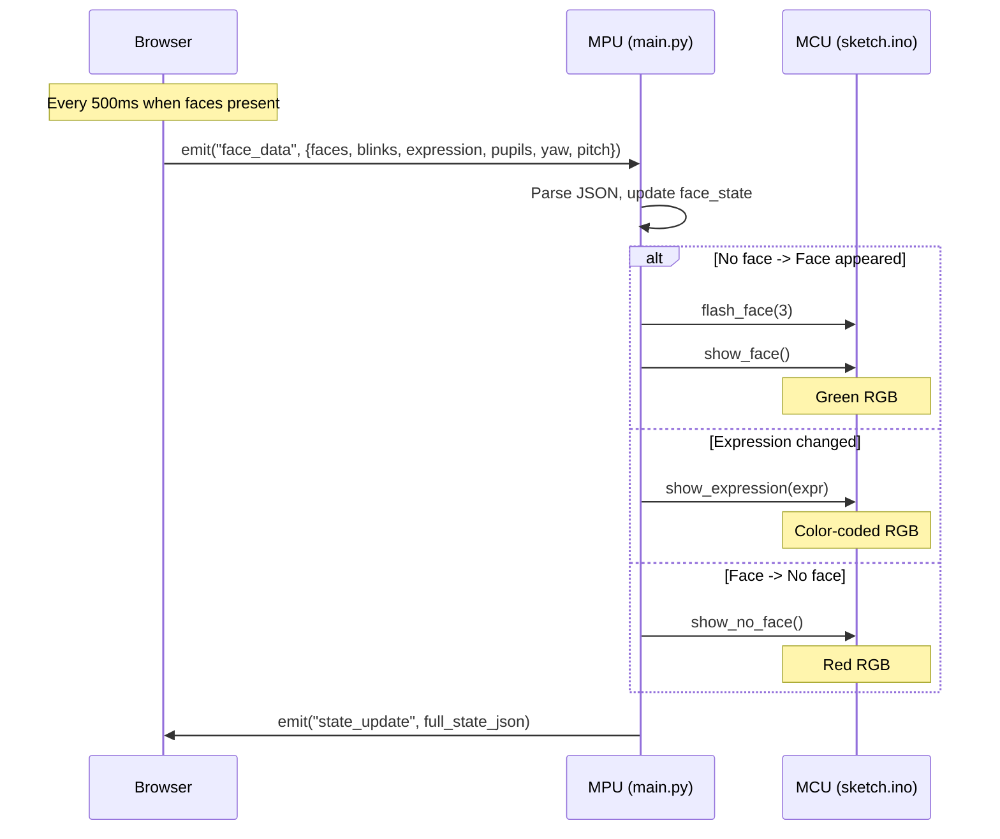

</details>

---

## Performance Bottlenecks

| Stage                            | Typical Latency | Bottleneck                |
|----------------------------------|-----------------|---------------------------|
| USB camera capture               | ~67ms (15 FPS)  | UVC webcam frame rate     |
| MediaPipe WASM inference         | ~5-15ms         | CPU (4x A53 cores)        |
| Canvas rendering (per face)      | ~1-2ms          | GPU compositing           |
| WebSocket emit (throttled)       | 500ms interval  | Intentional throttle      |
| Bridge RPC (MPU to MCU)          | ~2-5ms          | Serial transport          |
| LED matrix update                | <1ms            | SPI to matrix driver      |
| **Browser-side (camera to overlay)** | **~75-90ms**    | **Camera is the ceiling** |
| **Full loop (camera to LED)**    | **~500-575ms**  | **WebSocket throttle**    |

Browser-side rendering happens at full frame rate -- the camera is the ceiling. The MCU hardware response is gated by the 500ms WebSocket throttle, making end-to-end latency ~500-575ms. This throttle is intentional to avoid flooding the Bridge RPC channel.

The camera is the dominant bottleneck. The QRB2210's dual ISPs support up to 25 MP at 30 FPS through MIPI-CSI, but this demo uses a USB webcam at 640x480 / 15 FPS. The [UNO Media Carrier](https://docs.arduino.cc/hardware/uno-media-carrier/) with a MIPI-CSI camera would roughly double the frame rate.

The adaptive performance system compensates for CPU contention. When FPS drops below 8, the app skips every other frame. Recovery occurs when sustained FPS exceeds 14. Memory is rarely the bottleneck -- the 2 GB variant runs this demo comfortably.

## GPIO Placeholders

Pre-configured pins for extending the demo. All set as OUTPUT at boot but remain LOW unless their enable flag is set to `true` in `sketch.ino`. The MCU enforces a pin allowlist -- only D3-D7 can be toggled, and only when enabled.

| Pin | Name         | Default  | Use Case                                    |
|-----|--------------|----------|----------------------------------------------|
| D7  | PIN_RELAY    | disabled | Modulino Relay or generic 5V relay            |
| D6  | PIN_EXT_LED  | disabled | WS2812B NeoPixel strip data pin               |
| D5  | PIN_BUZZER   | disabled | Piezo buzzer (beep on face detection)         |
| D4  | PIN_AUX_1    | disabled | General-purpose (servo, sensor, Modulino)     |
| D3  | PIN_AUX_2    | disabled | General-purpose (PWM capable)                 |

To enable: set `enableRelay = true` (etc.) in sketch.ino. Control from Python: `Bridge.call("set_gpio", "7:1")`. Control from browser (App Lab only): WebSocket `gpio_control` event with `{pin: 7, state: 1}`.

## WebSocket Events (Browser -- MPU)

| Event              | Direction       | Payload                                                       |
|--------------------|-----------------|----------------------------------------------------------------|
| `face_data`        | Browser -> MPU  | `{faces, blinks, expression, pupilL, pupilR, yaw, pitch}`     |
| `capture_snapshot` | Browser -> MPU  | Snapshot request                                               |
| `rgb_control`      | Browser -> MPU  | `{"color": "green"}` (App Lab WebSocket only)                  |
| `gpio_control`     | Browser -> MPU  | `{"pin": 7, "state": 1}` (App Lab WebSocket only)             |
| `state_update`     | MPU -> Browser  | Full face state JSON                                           |
| `snapshot_ack`     | MPU -> Browser  | `{"status": "ok", "timestamp": "..."}`                        |
| `mpu_face_data`    | MPU -> Browser  | `{faces, source:"mpu", inference_ms, detections}` (AI Hub)    |
| `ai_status`        | MPU -> Browser  | `{available, status, model, running, fps, inference_ms}`      |
| `ai_toggle`        | Browser -> MPU  | `{enable: true/false}` (start/stop on-device detection)       |

## Dependencies

Designed to pull as few external resources as possible.

**MCU (sketch.ino):**

| Library              | Version    | Notes                                      |
|----------------------|------------|---------------------------------------------|
| Arduino_RouterBridge | 0.4.1      | Bridge RPC (primary dep in sketch.yaml)     |
| Arduino_RPClite      | 0.2.1      | Transitive dep of RouterBridge              |
| ArxContainer         | 0.7.0      | Transitive dep of RouterBridge              |
| ArxTypeTraits        | 0.3.2      | Transitive dep of RouterBridge              |
| DebugLog             | 0.8.4      | Transitive dep of RouterBridge              |
| MsgPack              | 0.4.2      | Transitive dep of RouterBridge              |
| Arduino_LED_Matrix   | (platform) | Bundled with arduino:zephyr board core      |

**MPU (python/main.py):** App Lab SDK (`arduino.app_utils`, `arduino.app_bricks.web_ui`) + Python stdlib. Optional for on-device AI: `tflite-runtime`, `numpy`, `opencv-python-headless`. For model compilation on a dev machine (not the Uno Q): `qai-hub`, `qai_hub_models`, `torch`.

**Browser (assets/index.html):**

| Resource                    | CDN                    | Pinned     | Required                           |
|-----------------------------|------------------------|------------|------------------------------------|
| @mediapipe/tasks-vision     | jsdelivr               | 0.10.3     | Yes                                |
| face_landmarker.task model  | Google Cloud Storage   | float16/1  | Yes (~4MB, cached)                 |
| Google Fonts (Inter, JetBrains Mono) | Google Fonts  | latest     | No (degrades to system fonts)      |

**Replit preview only (app.py):** `flask` and `psutil`. Both excluded from the App Lab project via `.gitignore`.

---

<details>
<summary><strong>Beyond Face Tracking: Industrial and Pro Applications</strong></summary>

This demo is a proof-of-concept for the Uno Q's dual-processor architecture, but the pattern it demonstrates -- AI inference feeding into a Python coordinator on Debian, which drives real-time MCU actuation via Bridge RPC -- applies directly to [Arduino Pro](https://www.arduino.cc/pro/) industrial use cases.

| Application                     | How it works with this architecture                                                                                   |
|----------------------------------|------------------------------------------------------------------------------------------------------------------------|
| **Access control**               | Replace LED feedback with a relay on D7 for a door strike. `show_face()` sets relay HIGH, `show_no_face()` drops it. Enable with `enableRelay = true` in sketch.ino |
| **Occupancy monitoring**         | Use persistent face count (MAX_FACES = 4) and tracking lifecycle. Forward count to BMS via Wi-Fi for HVAC/lighting    |
| **Safety compliance**            | Swap MediaPipe for `arduino:object_detection` Brick (YOLOX-Nano). Detect PPE/hard hats. Buzzer on D5 for alerts       |
| **Quality inspection**           | Mount MIPI-CSI camera via Media Carrier. Vision model + Python classification + MCU GPIO for reject actuators          |
| **Operator presence detection**  | Face tracking 800ms TTL as presence signal. Wire D7 to safety interlock relay. MCU at Zephyr real-time priority        |
| **Retail analytics**             | Count foot traffic, measure dwell time via persistent face IDs. Forward to Arduino Cloud dashboards                    |
| **Agriculture / environmental**  | Replace camera AI with sensor Bricks (Modulino Movement, Distance). MCU drives pumps, valves, alerts via GPIO          |

</details>

<details>
<summary><strong>The App Lab and Bricks Experience</strong></summary>

The [Arduino App Lab](https://docs.arduino.cc/software/app-lab/) is a unified development environment that lets you combine Arduino sketches, Python scripts, and containerized Linux applications into a single workflow. You do not need to manually set up a toolchain, configure a cross-compiler, or wire up a web server.


[Bricks](https://docs.arduino.cc/software/app-lab/tutorials/bricks) are code building blocks that abstract away complexity. This project uses a single Brick:

- **`arduino:web_ui`** -- serves the contents of `assets/` as a web application and provides WebSocket messaging between the browser and `python/main.py`. The Brick injects WebSocket connectivity at runtime. No explicit socket code is needed in the HTML.


To install this demo, download the repository as a `.zip`, open [Arduino App Lab](https://www.arduino.cc/en/software/#app-lab-section), click Import App, and select the file.

</details>

<details>
<summary><strong>Expanding the Hardware</strong></summary>

The Uno Q retains the classic UNO form factor for shield compatibility, and adds two bottom-mounted high-speed connectors (JMEDIA and JMISC) for advanced peripherals.


**Carrier boards:**

| Carrier                                                                          | What it adds                                                                                                       |
|----------------------------------------------------------------------------------|--------------------------------------------------------------------------------------------------------------------|
| [UNO Media Carrier](https://docs.arduino.cc/hardware/uno-media-carrier/)         | Dual MIPI-CSI camera connectors (RPi compatible), MIPI-DSI display output, three 3.5 mm audio jacks               |
| [UNO Breakout Carrier](https://docs.arduino.cc/hardware/uno-breakout-carrier/)   | Full breakout of JMEDIA/JMISC signals to 2.54 mm headers -- audio, I2C, SPI, UART, PWM, PSSI, GPIO                |

**Qwiic / Modulino sensors** (no soldering, I2C on Wire1):

| Modulino                                                                         | Use with this demo                                                                     |
|----------------------------------------------------------------------------------|-----------------------------------------------------------------------------------------|
| [Modulino Movement](https://docs.arduino.cc/hardware/modulino-movement/)         | LSM6DSOX accelerometer/gyroscope -- detect tilt/movement while tracking                 |
| [Modulino Distance](https://docs.arduino.cc/hardware/modulino-distance/)         | Time-of-flight -- measure viewer distance from camera                                   |
| [Modulino Buttons](https://docs.arduino.cc/hardware/modulino-buttons/)           | Physical buttons -- cycle overlay presets or toggle tracking                             |

</details>

<details>
<summary><strong>Arduino Cloud Integration (Future)</strong></summary>

The current demo runs entirely on the local network. [Arduino Cloud](https://docs.arduino.cc/arduino-cloud/) could add:

- Log timestamp and screenshot of each new face detection to a cloud Thing
- Persistent face count across sessions (daily/weekly)
- Live dashboard showing tracking state, uptime, and system health remotely
- Webhook notifications when a face is detected (or absent for a threshold period)
- Historical data export via [Arduino Cloud's built-in data export](https://docs.arduino.cc/arduino-cloud/features/iot-cloud-historical-data/)

The Uno Q's built-in Wi-Fi and the WebUI Brick's `web_ui.expose_api()` pattern make this feasible without restructuring the app.

</details>

---

<details>
<summary><strong>Supplemental Reference: Advanced AI Model Options</strong></summary>

> **Note:** The sections below describe AI model workflows that are technically possible on the Uno Q's QRB2210 but are **not part of this demo** and **not included in the App Lab zip**. They require additional software (tflite-runtime, OpenCV, numpy), a camera on the MPU, and in some cases cloud accounts. Some workflows are more naturally suited to the upcoming **Ventuno Q** (40-TOPS NPU).

### What is Qualcomm AI Hub?

[Qualcomm AI Hub](https://aihub.qualcomm.com/) takes pre-trained AI models (PyTorch, ONNX, TensorFlow) and compiles them into optimized runtimes for specific Qualcomm chipsets. The QRB2210 has **no NPU** -- AI Hub's main value here is operator fusion and optional quantization, not NPU offloading.

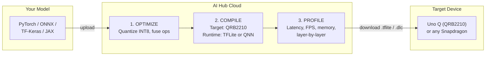

You can profile your model on the QRB2210 _in the cloud_ before you even have the hardware. AI Hub maintains a fleet of hosted Qualcomm devices for remote profiling.

### On-device inference via AI Hub (optional, not in this demo)

The `python/face_detector_mpu.py` module implements an alternative path: face detection runs natively on the QRB2210 using `tflite-runtime`, bypassing the browser.

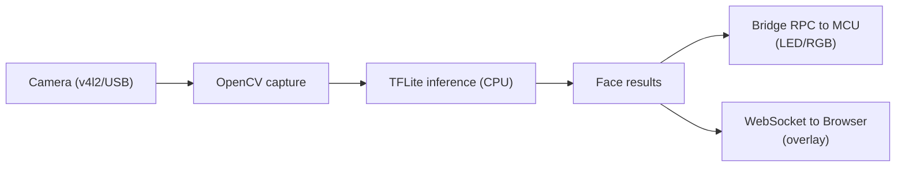

**TFLite delegates on QRB2210:**

<p align="center">
  
</p>

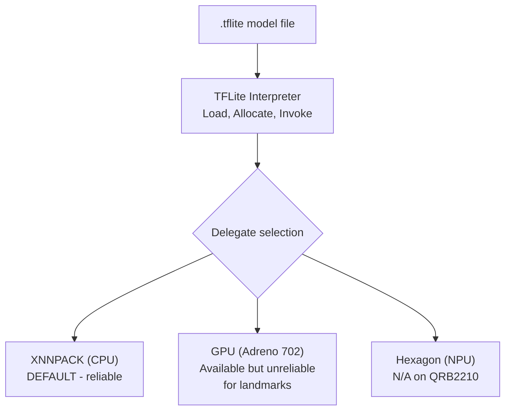

**Hardware constraints on the QRB2210:**

| Spec     | Value                              | Impact                                                              |
|----------|------------------------------------|----------------------------------------------------------------------|
| CPU      | Cortex-A53 @ 2.0 GHz (4 cores)    | TFLite runs here. INT8 face_det_lite: ~5-15ms/frame                 |
| GPU      | Adreno 702 @ 845 MHz              | GPU delegate available but slower for small models. Incorrect landmarks |
| NPU/TPU  | None (0 TOPS)                      | No hardware neural network accelerator                               |
| Camera   | USB (UVC) or MIPI-CSI via Carrier  | 640x480 @ 15 FPS ceiling for USB. MIPI-CSI supports higher           |
| RAM      | 2 GB or 4 GB LPDDR4               | Model + OpenCV + TFLite uses ~80-120 MB                              |

**Setup:**

```bash
# On your dev machine -- compile model for QRB2210 via AI Hub cloud
pip install qai-hub qai_hub_models torch
qai-hub configure --api_token YOUR_TOKEN
python python/ai_hub_setup.py --compile --model face_det_lite --device QRB2210

# Copy the .tflite file to the Uno Q
scp python/models/face_det_lite.tflite unoq:~/face-demo/python/models/

# On the Uno Q -- install runtime deps
pip install tflite-runtime numpy opencv-python-headless

# Reboot the app -- it auto-discovers .tflite files in python/models/ at boot
```

The system always works without AI Hub models. Missing dependencies result in graceful fallback to browser-only mode (MediaPipe WASM).

**Inference approaches comparison:**

| Approach                     | In this demo? | Where it runs       | Setup effort                        | Best for                          |
|------------------------------|:---:|----------------------|--------------------------------------|---------------------------------------|
| Browser (MediaPipe WASM)     | **Yes**       | Client browser       | Zero -- loads from CDN               | Demos, face landmarks (this demo)     |
| App Lab Brick                | **Partially** | QRB2210 Docker       | Low -- add one line to app.yaml      | Standard tasks (object detection)     |
| AI Hub TFLite                | No            | QRB2210 MPU native   | Medium -- compile + install deps     | Optimized headless inference          |
| Hugging Face model           | No            | QRB2210 MPU native   | Medium-High -- export to TFLite      | Research models, niche tasks          |
| Custom model (Edge Impulse)  | No            | QRB2210 MPU native   | High -- train + export + deploy      | Domain-specific, proprietary data     |

### Bringing a Hugging Face model

Models on [Hugging Face Hub](https://huggingface.co/) that can be exported to TFLite format can run on the Uno Q using the same `tflite-runtime` infrastructure.

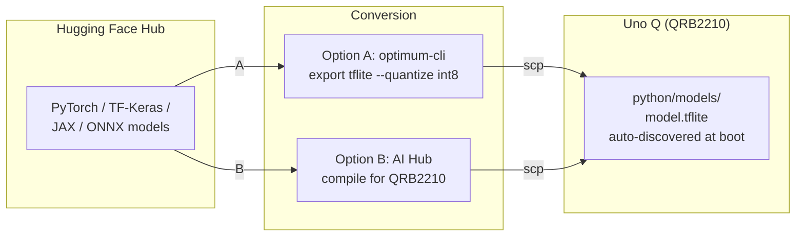

1. **Export to TFLite** via `optimum-cli export tflite --model google/vit-base-patch16-224 --quantize int8`. Not all architectures support TFLite export -- check [supported architectures](https://huggingface.co/docs/optimum/exporters/tflite/overview).
2. **Drop the `.tflite` into `python/models/`.** Modify `face_detector_mpu.py` to match input/output signatures if different.
3. **Run inference.** The same `tflite-runtime` runs any valid TFLite model.

Stick to mobile-optimized architectures (MobileNetV2/V3, EfficientNet-Lite, NanoDet, PicoDet). Models under 5M parameters with 320x320 input run comfortably on the A53 cores.

### Bringing a custom Edge Impulse model

[Edge Impulse](https://edgeimpulse.com/) trains custom ML models on your own data. Models trained there export as TFLite and run on the Uno Q identically to AI Hub models.

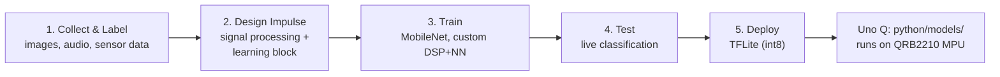

> Edge Impulse also has a direct Arduino library export (C++), but that targets the STM32 MCU which is too constrained for most ML models (Cortex-M33, 786 KB SRAM). Use the TFLite export to the MPU side instead.

### AI model ecosystem for Uno Q

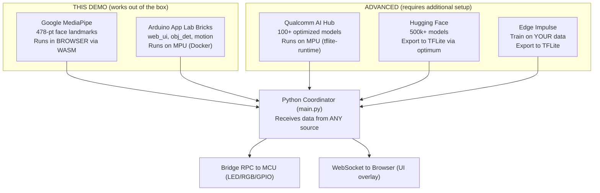

### The decision tree

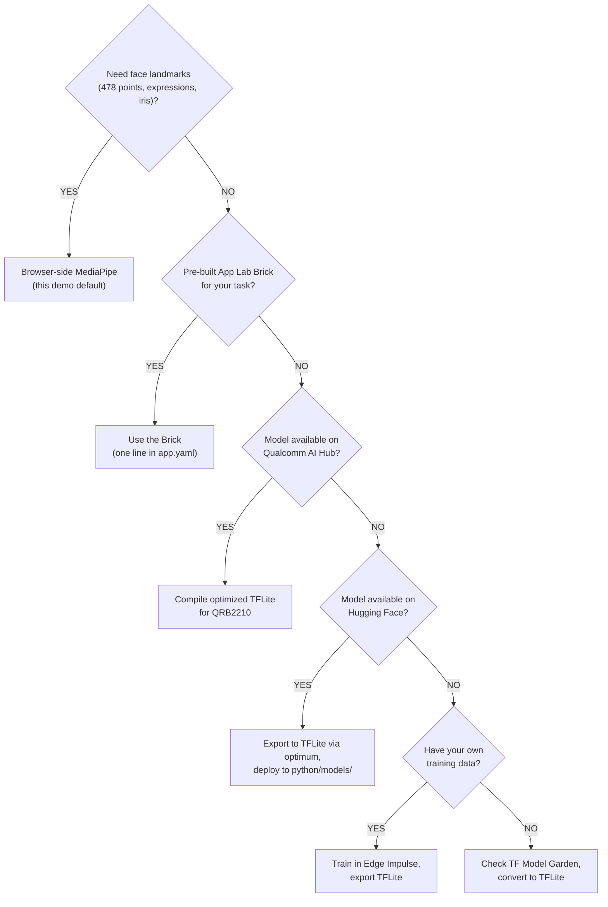

In all cases, the MCU layer, Bridge providers, WebSocket events, and Python coordinator remain the same. Only the inference source changes.

</details>

---

<details>
<summary><strong>Further Reading: Where the Uno Q fits in Qualcomm's world</strong></summary>

> **Context section.** The material below is background reading about Qualcomm's product ecosystem, the upcoming Ventuno Q, and industry trends. None of it is required to use this demo.

### Qualcomm Dragonwing IoT Processor Lineup

The QRB2210 is Qualcomm's entry-tier IoT processor:

| Feature          | QRB2210 (Uno Q)                  | QCS6490                                    | QCS8550                                  |
|------------------|----------------------------------|--------------------------------------------|------------------------------------------|
| **Series**       | Q2 (Dragonwing)                  | Q6 (Dragonwing)                            | Q8 (Dragonwing)                          |
| **CPU**          | 4x Cortex-A53 @ 2.0 GHz         | Kryo 670 (big.LITTLE)                      | Kryo (big.LITTLE)                        |
| **GPU**          | Adreno 702                       | Adreno 643                                 | Adreno 740                               |
| **NPU**          | None (0 TOPS)                    | Hexagon DSP + HTA (up to ~12 TOPS)         | Hexagon NPU (up to ~48 TOPS)            |
| **RAM**          | 2-4 GB LPDDR4                    | Up to 8 GB LPDDR4X                         | Up to 16 GB LPDDR5X                     |
| **AI inference** | CPU/GPU TFLite only              | NPU-accelerated (QNN, SNPE)                | NPU-accelerated (QNN)                   |
| **Use case**     | Entry IoT, prototyping, education | Mid-tier edge AI, smart cameras            | High-end edge AI, robotics, automotive  |
| **Arduino board**| Uno Q                            | --                                          | --                                       |
| **Approx. cost** | ~$25                             | ~$80                                        | ~$150+                                   |
| **TDP**          | 2-5W                             | 5-10W                                       | 10-15W                                   |

_QCS6490 and QCS8550 specs are approximate. Consult [Qualcomm's product pages](https://www.qualcomm.com/products/technology/processors) for exact specifications._

### Qualcomm Silicon Market Map (2025-2026)

| Brand       | Segment                | Key Products                                             | Revenue          |
|-------------|------------------------|----------------------------------------------------------|------------------|
| Snapdragon  | Mobile                 | 8 Elite (Gen 5), 7s / 6s / 4 Gen 3                      | ~$27B/yr         |
| Snapdragon  | PC / Compute           | X2 Elite (Oryon Gen 3), X Plus. Up to ~80 TOPS NPU      | (included above) |
| Snapdragon  | Automotive             | Cockpit Elite, Ride (ADAS), Digital Chassis              | ~$4B/yr          |
| Snapdragon  | XR (AR/VR/MR)          | XR2+ Gen 2. Powers Meta Quest 3, Samsung Galaxy XR       | (included above) |
| Dragonwing  | IoT (Q Series)         | QCS8550 (Q8), QCS6490 (Q6), **QRB2210 (Q2) = UNO Q**   | ~$6.6B/yr        |
| Dragonwing  | Robotics (IQ Series)   | IQ10 (humanoids), **IQ8 = VENTUNO Q**, IQ6 (drones)     | (included above) |
| Qualcomm    | Networking / Infra     | 5G RAN, Small Cells, Fixed Wireless, Wi-Fi 7             | (separate)       |

_Total Qualcomm revenue (FY2025): ~$44B. Source: Qualcomm FY2025 earnings. Segment figures are approximate._

### Uno Q vs Ventuno Q

Qualcomm announced its intent to acquire Arduino in October 2025. The combined entity is executing a two-board hardware strategy:

| Spec                 | Arduino Uno Q (Shipping now)         | Arduino Ventuno Q (Announced EW 2026)     |
|----------------------|--------------------------------------|-------------------------------------------|
| **MPU**              | Qualcomm QRB2210 (Q2 Series)         | Qualcomm Dragonwing IQ8 (IQ-8275)        |
| **CPU**              | 4x Cortex-A53 @ 2.0 GHz             | 8-core Kryo (up to ~2.4 GHz)             |
| **GPU**              | Adreno 702                           | Adreno                                    |
| **NPU**              | None (0 TOPS)                        | Hexagon Tensor (~40 TOPS)                |
| **RAM**              | 2-4 GB LPDDR4                        | 16 GB LPDDR5                              |
| **Storage**          | 16-64 GB eMMC                        | 64 GB eMMC + M.2 NVMe                    |
| **MCU**              | STM32U585 (Cortex-M33, 786 KB SRAM)  | STM32H5F5 (Cortex-M33, higher SRAM)      |
| **OS**               | Debian Linux + Zephyr                | Ubuntu/Debian + Zephyr                    |
| **Price**            | ~$90 (4 GB)                          | ~$300 (expected)                           |
| **Best for**         | Learning, prototyping, IoT gateways  | On-device LLMs, NPU vision, robotics     |

Both boards share: dual-brain architecture (MPU + MCU via Bridge), App Lab + Bricks ecosystem, Arduino IDE/Cloud compatibility, Python (MPU) + C++ Sketch (MCU) programming model, and the same Bridge API pattern.

_Ventuno Q specs are based on the Embedded World 2026 announcement and may change. Verify at [arduino.cc](https://www.arduino.cc/)._

The Ventuno Q's ~40-TOPS NPU fundamentally changes what's possible. Models impractical on the Uno Q's CPU-only path become real-time on the Ventuno Q. The same app architecture ports directly -- change the target device in AI Hub and redeploy.

### Qualcomm's full-stack edge AI ecosystem

Assembled through acquisitions (2024-2025):

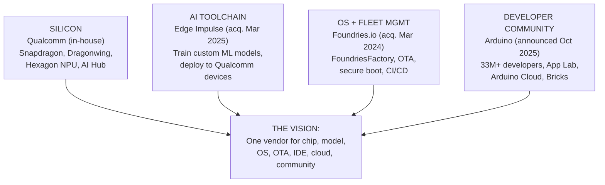

| Stage          | Tool                                | What it does                                    |
|----------------|--------------------------------------|-------------------------------------------------|
| **Prototype**  | Arduino IDE / App Lab                | Write sketch + Python, test on single board     |
| **Train AI**   | Edge Impulse                         | Train custom model on your data, export TFLite  |
| **Optimize**   | AI Hub                               | Compile + quantize model for QRB2210 or IQ8     |
| **Secure OS**  | FoundriesFactory                     | Hardened Linux, secure boot, container isolation|
| **Deploy fleet** | FoundriesFactory + Arduino Cloud   | OTA updates to 10 or 10,000 boards              |
| **Monitor**    | Arduino Cloud                        | Dashboard, alerts, remote management            |

### App Lab and Bricks -- what's coming

| Version | Date     | Additions                                                                         |
|---------|----------|------------------------------------------------------------------------------------|
| 0.4.0   | Feb 2026 | Import/export (zip), firmware flasher, offline mode, syntax highlighting           |
| 0.5.x+  | Mid 2026 | Expected: expanded Brick catalog, improved AI model management, Edge Impulse integration |

### Edge AI industry trajectory

| Trend (2026)                                  | Near future (2027-2028)                                  |
|-----------------------------------------------|-----------------------------------------------------------|
| NPU becoming standard in mid/high-end chips   | NPU in every tier of silicon, even entry-level IoT        |
| SLMs running on phones/PCs (Phi-3, Gemma)     | On-device agents that reason and act without cloud        |
| Edge Impulse + AI Hub as separate tools        | Unified train-optimize-deploy pipeline                    |
| FoundriesFactory for OTA + fleet security      | Zero-touch provisioning: board boots, auto-joins fleet    |
| Uno Q = CPU-only prototyping board             | Ventuno Q and successors = production-grade edge AI       |

The broader edge computing market is projected to grow from ~$25-30B (2026) to $250-350B by the early 2030s.

**What this means for the Uno Q:**

- **It is a learning and prototyping platform**, not a production AI inference engine. Its value is teaching the architecture that scales to the Ventuno Q and beyond.
- **The code you write today is portable.** Python coordinator, Bridge providers, sketch structure, and App Lab workflow are identical on the Ventuno Q.
- **NPU is coming to every tier.** The CPU-only constraint of the QRB2210 is a temporary limitation of this generation.

### Qualcomm Physical AI Stack

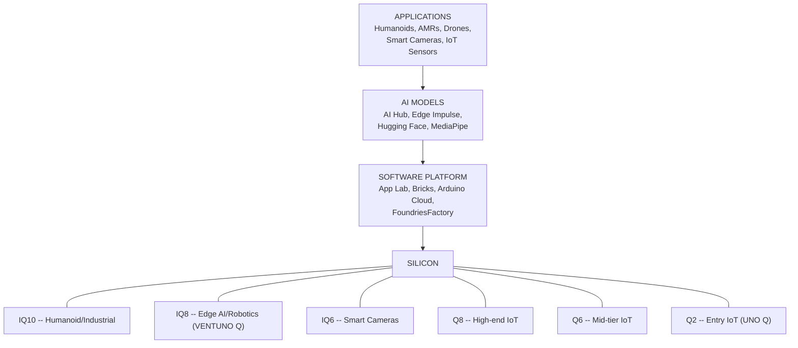

The face detection demo running on this Uno Q is a small example of this larger arc. The same architectural pattern -- camera input, AI inference, Bridge to MCU, real-time actuation -- is how a warehouse robot processes its environment, how a smart camera identifies defects, and how a drone navigates autonomously. The Uno Q teaches the pattern at an accessible price point.

</details>

## Links

- [Arduino Uno Q Hardware](https://docs.arduino.cc/hardware/uno-q/)
- [UNO Q User Manual](https://docs.arduino.cc/tutorials/uno-q/user-manual/)
- [UNO Q Pinout (PDF)](https://docs.arduino.cc/resources/pinouts/ABX00162-full-pinout.pdf)
- [UNO Q Datasheet (PDF)](https://docs.arduino.cc/resources/datasheets/ABX00162-ABX00173-datasheet.pdf)
- [Arduino Ventuno Q (Embedded World 2026)](https://blog.arduino.cc/)
- [Arduino App Lab](https://docs.arduino.cc/software/app-lab/)
- [App Lab Bricks](https://docs.arduino.cc/software/app-lab/tutorials/bricks)
- [Arduino Cloud](https://docs.arduino.cc/arduino-cloud/)
- [Google MediaPipe Face Landmarker](https://ai.google.dev/edge/mediapipe/solutions/vision/face_landmarker)
- [Qualcomm AI Hub](https://aihub.qualcomm.com/)
- [Qualcomm AI Hub Models](https://aihub.qualcomm.com/models)
- [Qualcomm Dragonwing Platform](https://www.qualcomm.com/products/technology/processors)
- [Edge Impulse](https://edgeimpulse.com/)
- [Foundries.io / FoundriesFactory](https://foundries.io/)
- [Hugging Face Hub](https://huggingface.co/models)
- [TensorFlow Lite Model Garden](https://www.tensorflow.org/lite/models)
- [Buy Arduino Uno Q](https://store.arduino.cc/pages/uno-q)
