<div align="center">

# Wojo's Uno Q Face Outline Demo

### Real-Time Face Tracking on the Arduino Uno Q

<br/>

[](https://docs.arduino.cc/hardware/uno-q/)
[](https://www.qualcomm.com/products/technology/processors)
[](https://ai.google.dev/edge/mediapipe/solutions/vision/face_landmarker)
[](https://docs.arduino.cc/software/app-lab/)
[](LICENSE)

<br/>

**478-point face landmarks &nbsp;|&nbsp; Up to 4 simultaneous faces &nbsp;|&nbsp; Expression detection &nbsp;|&nbsp; LED matrix feedback**

<br/>

A dual-processor edge AI demo built for the [Arduino Uno Q](https://docs.arduino.cc/hardware/uno-q/) --
Qualcomm QRB2210 + STM32U585 working together through
[Arduino App Lab](https://docs.arduino.cc/software/app-lab/) and the
[Bricks SDK](https://docs.arduino.cc/software/app-lab/tutorials/bricks).

</div>

<br/>

---

<br/>

## Table of Contents

1. [Why the Arduino Uno Q](#why-the-arduino-uno-q)
2. [Features at a Glance](#features-at-a-glance)
3. [Architecture](#architecture)
4. [Quick Start](#quick-start)
5. [Project Structure](#project-structure)
6. [State Diagrams](#state-diagrams)
7. [Performance](#performance)
8. [GPIO Placeholders](#gpio-placeholders)
9. [WebSocket Events](#websocket-events)
10. [Dependencies](#dependencies)
11. [Advanced Topics](#advanced-topics)
12. [Links & Resources](#links--resources)
13. [Contributing](#contributing)
14. [License](#license)

<br/>

---

<br/>

## Why the Arduino Uno Q

The [Arduino Uno Q](https://docs.arduino.cc/hardware/uno-q/) is **not a typical Arduino**.
It is a single-board computer with an embedded MCU, designed for AI at the edge.

<br/>

<p align="center">
  
</p>

<br/>

| Component   | Silicon              | Key Specs                                                                          |
|:------------|:---------------------|:-----------------------------------------------------------------------------------|
| **MPU**     | Qualcomm QRB2210     | Quad-core Cortex-A53 @ 2.0 GHz, Adreno 702 GPU, Wi-Fi 5, BT 5.1, 2/4 GB LPDDR4   |
| **MCU**     | STM32U585            | Cortex-M33 @ 160 MHz, 2 MB flash, 786 KB SRAM, Zephyr RTOS                        |
| **Bridge**  | Arduino Bridge RPC   | Built-in serial link between MPU and MCU -- no wiring needed                       |

<br/>

The two processors communicate through a built-in RPC library called **Arduino Bridge**.
This demo exercises the full pipeline: browser-side AI inference, WebSocket telemetry to a
Python coordinator on Debian, Bridge RPC forwarding to the STM32 MCU, and physical feedback
through the built-in 13x8 LED matrix and RGB LED.

<br/>

<p align="center">
  
</p>

<br/>

> **Tip:** For full pinout details, datasheet, schematics, and CAD files, see the
> [official hardware page](https://docs.arduino.cc/hardware/uno-q/) and the
> [UNO Q User Manual](https://docs.arduino.cc/tutorials/uno-q/user-manual/).

<br/>

---

<br/>

## Features at a Glance

| Feature                        | Description                                                                                                |
|:-------------------------------|:-----------------------------------------------------------------------------------------------------------|
| **478-Point Face Landmarks**   | Google MediaPipe Face Landmarker running in-browser via WASM -- zero setup, no model compilation            |
| **Multi-Face Tracking**        | Up to **4 simultaneous faces** with persistent IDs, unique colors, and 800ms TTL grace period              |
| **Expression Detection**       | Smile, surprise, eyebrow raise -- mapped to color-coded RGB LED feedback on the MCU                        |
| **Blink & Pupil Tracking**     | Eye Aspect Ratio (EAR) blink detection + iris diameter measurement in real time                            |
| **LED Matrix Visualization**   | 13x8 grayscale bitmaps: smiley (face detected), X (no face), expression icons, IP scroll on boot          |
| **Adaptive Performance**       | Auto-throttles frame processing when FPS drops below 8; recovers when FPS exceeds 14                      |
| **Swappable AI Source**        | Architecture decouples inference from actuation -- swap MediaPipe for App Lab Bricks, AI Hub, or Edge Impulse |
| **Full Boot Diagnostics**      | CPU, RAM, network, DNS, CDN reachability checks printed to terminal on every startup                       |
| **Bridge RPC Handshake**       | MCU retries `mcu_ready` every 3s for up to 3 minutes; MPU acknowledges from a background thread            |
| **GPIO Expansion Ready**       | 5 pre-configured pins (D3-D7) for relay, buzzer, NeoPixel, or Modulino accessories                        |

<br/>

---

<br/>

## Architecture

### System Overview

<br/>

<p align="center">
  
</p>

<details>
<summary>Diagram source (Mermaid)</summary>

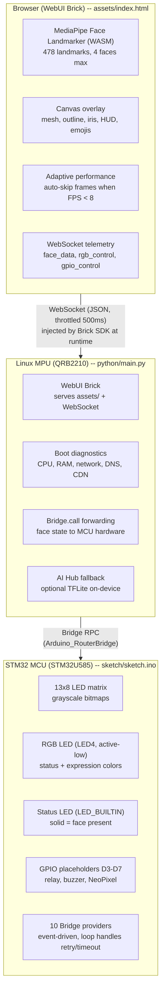

</details>

<br/>

### Data Flow Pipeline

<br/>

<p align="center">
  
</p>

<details>
<summary>Diagram source (Mermaid)</summary>

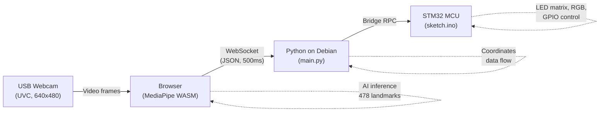

</details>

<br/>

### Compute Architecture

The Uno Q has **four distinct compute blocks**:

<br/>

<p align="center">
  
</p>

<br/>

| Block    | Silicon                           | Clock     | Role in This Demo                                                                                     |
|:---------|:----------------------------------|:----------|:------------------------------------------------------------------------------------------------------|
| **CPU**  | Quad-core Arm Cortex-A53 (Kryo)   | 2.0 GHz   | Runs Debian Linux, Python coordinator, Docker containers for App Lab Bricks, and the Chromium browser  |
| **GPU**  | Qualcomm Adreno 702               | 845 MHz   | OpenGL ES 3.1, Vulkan 1.1, OpenCL 2.0 -- available for WebGL rendering and TFLite GPU delegate        |
| **DSP**  | Dual-core Qualcomm Hexagon        | --        | Audio signal processing and always-on low-power tasks. *Not used by this demo*                         |
| **MCU**  | STM32U585 Arm Cortex-M33          | 160 MHz   | Runs Arduino sketch on Zephyr OS -- drives LED matrix, RGB LED, status LED, and GPIO                   |

<br/>

> **Architecture Note:** The QRB2210 has **no dedicated TPU or NPU** (no TOPS rating).
> AI inference relies on the CPU and GPU through framework runtimes like TFLite and WASM.
> This is an intentional tradeoff -- the QRB2210 is Qualcomm's entry-tier IoT processor,
> optimized for low power and cost. For NPU-accelerated inference, Qualcomm's higher-tier
> processors (QCS6490, QCS8550) include the Hexagon Tensor Processor.

<br/>

### App Lab Bricks

The `arduino:web_ui` Brick powers this demo. It serves HTML/JS from `assets/`, provides
WebSocket messaging between the browser and Python, and requires **zero configuration**
beyond one line in `app.yaml`.

<br/>

| Brick                          | What It Does                                  | Setup                               |
|:-------------------------------|:----------------------------------------------|:------------------------------------|
| **`arduino:web_ui`**           | Serves web content + WebSocket                | **This demo uses it**               |
| `arduino:object_detection`     | Detects objects in camera frames (YOLOX-Nano)  | Add one line to `app.yaml`          |
| `arduino:motion_detection`     | Detects motion in video stream                | Add one line to `app.yaml`          |

<br/>

```yaml
bricks:
  - arduino:web_ui
  - arduino:object_detection   # optional -- add any Brick with one line
```

<br/>

> **Tip:** Each Brick deploys as a container on the QRB2210 and exposes an API
> to your Python code. No Docker configuration required.

<br/>

---

<br/>

## Quick Start

### Hardware Requirements

| Component       | Details                                                                                                      |
|:----------------|:-------------------------------------------------------------------------------------------------------------|
| **Board**       | [Arduino Uno Q](https://store.arduino.cc/pages/uno-q) (QRB2210 + STM32U585, 2 GB or 4 GB)                   |
| **LED Matrix**  | Built-in 13x8 (no wiring needed)                                                                             |
| **Camera**      | Standard UVC USB webcam                                                                                       |
| **Connection**  | [USB-C multiport adapter](https://store.arduino.cc/products/usb-c-to-hdmi-multiport-adapter-with-ethernet-and-usb-hub) with external power delivery |
| **Browser**     | Chrome or Edge on any device on the same network                                                              |

<br/>

The board can be powered via USB-C (5V 3A), the 5V pin, or VIN (7-24V):

<br/>

<p align="center">
  
</p>

<br/>

### Installation

App Lab runs in two modes: **directly on the Uno Q** as a single-board computer
(SBC mode, recommended with the 4 GB variant), or **hosted on your PC** with the
board connected via USB-C.

<br/>

<p align="center">
  
</p>

<br/>

**Get running in five steps:**

1. **Download** this repository as a `.zip` file.

2. **Open** [Arduino App Lab](https://www.arduino.cc/en/software/#app-lab-section) --
   pre-installed on the Uno Q in SBC mode, or install the desktop version on your PC.

3. **Import** -- click **Import App** and select the `.zip` file.

4. **Wait** -- App Lab reads `app.yaml`, compiles the sketch for the STM32 MCU,
   deploys the WebUI Brick, and launches the application automatically.

5. **Connect** -- the LED matrix will display the board's IP address.
   Open that address in Chrome on any device on the same Wi-Fi network.

<br/>

> **Quick SSH setup (yzma style):** If you prefer the terminal over App Lab,
> this project supports a direct-run workflow inspired by the
> [yzma LLM project](https://projecthub.arduino.cc/marc-edgeimpulse/running-local-llms-and-vlms-on-the-arduino-uno-q-with-yzma-74e288):
>
> ```bash
> ssh arduino@<IP>
> git clone https://github.com/wojo/face-tracker-uno-q && cd face-tracker-uno-q
> ./setup.sh                        # installs deps + downloads face detection models
> python3 direct/face_tracker.py    # standalone face tracking (no App Lab needed)
> ```
>
> Or download individual models yzma-style:
> ```bash
> ./model_get.sh --list                     # see available models
> ./model_get.sh face-detection             # download YuNet face detector (233 KB)
> ./model_get.sh face-mesh                  # download 468-landmark mesh model
> ./model_get.sh -u <huggingface_url>       # download any custom ONNX model
> ```
>
> The standalone tracker uses OpenCV YuNet (75K params) for face detection and
> optionally ONNX Runtime for 468-landmark face mesh -- all running natively on
> the Cortex-A53. MCU LED matrix and RGB LED are controlled via the system-level
> `arduino-router` Bridge service (no App Lab required).

<br/>

### First-Time Setup on a Fresh Board

If this is a brand-new Uno Q that has never been connected to App Lab before,
expect several update prompts before the demo runs.

<br/>

<details>
<summary><strong>What App Lab will prompt you to update</strong></summary>

<br/>

| Prompt                             | What It Updates                                    | Action       | What Happens If You Skip                          |
|:-----------------------------------|:---------------------------------------------------|:-------------|:--------------------------------------------------|
| System firmware                    | Linux OS image on the QRB2210 MPU                  | **Accept**   | Risk kernel/driver incompatibilities              |
| Arduino board core (Zephyr)        | Zephyr RTOS platform for STM32 MCU sketches        | **Accept**   | Sketch compilation will likely fail               |
| Board firmware (STM32 bootloader)  | Low-level MCU bootloader                           | **Accept**   | `Bridge.begin()` may hang or fail silently        |
| Brick container updates            | Docker images for WebUI Brick and App Lab services | **Accept**   | Demo cannot start without the WebUI Brick         |

<br/>

</details>

<br/>

**After accepting all updates:**

1. **Wait for reboot.** The board may reboot more than once. Wait for the green
   power LED to stabilize -- this can take **60-90 seconds** on first boot
   after a firmware update.

2. **Connect to Wi-Fi** if not already configured via **App Lab > Settings > Network**.
   The demo needs internet access to download MediaPipe (~4 MB) from
   `cdn.jsdelivr.net` on first load. After that, the browser caches everything.

3. **Import the demo** `.zip` and let App Lab compile the sketch (~30-60 seconds).
   The LED matrix will show a boot icon, then a checkmark, then scroll the
   board's IP address.

4. **Open the IP address** in Chrome on any device on the same Wi-Fi network.

<br/>

### Troubleshooting

<details>
<summary><strong>Common issues and fixes</strong></summary>

<br/>

| Symptom                                         | Likely Cause                               | Fix                                                                                      |
|:-------------------------------------------------|:-------------------------------------------|:-----------------------------------------------------------------------------------------|
| Blank screen, no error                           | JavaScript module failed to load           | Open browser console (F12), check network errors -- usually `cdn.jsdelivr.net` unreachable |
| "Cannot Load Face Detection Engine" overlay      | No internet                                | Connect to Wi-Fi and hit the Retry button                                                |
| LED matrix stays on boot icon                    | `Bridge.begin()` stuck (firmware mismatch) | Accept all pending updates in App Lab, re-import                                         |
| "No Camera Detected" overlay                     | No USB webcam plugged in                   | Plug a USB webcam into any USB-A port (MIPI-CSI requires Media Carrier)                  |
| Camera permission denied                         | Browser blocking camera access             | Check browser settings > Site permissions > Camera > Allow                                |
| MCU shows red LED, Python says "MCU ready"       | Normal behavior                            | MCU starts red (idle) -- turns green when first face is detected                         |
| Sketch won't compile                             | Outdated board core                        | Ensure `arduino:zephyr` is installed and up to date                                      |

<br/>

</details>

<br/>

<details>
<summary><strong>Recovery if you declined updates</strong></summary>

<br/>

If you said "No" to one or more update prompts and the demo doesn't work:

1. Open App Lab settings
2. Check for board/firmware/core updates
3. Accept all pending updates
4. Reboot the board
5. Re-import the demo `.zip`

<br/>

> **Note:** The MCU sketch includes an acknowledgement-driven retry mechanism --
> it re-sends `mcu_ready` every 3 seconds for up to 3 minutes after boot. Once the
> MPU receives the signal, it dispatches `mpu_ack` from a background thread (to avoid
> deadlocking the Bridge read loop), and the MCU stops retrying.

<br/>

</details>

<br/>

---

<br/>

## Project Structure

```
.
├── app.yaml                    # App Lab manifest (bricks: arduino:web_ui)
│
├── python/
│   ├── main.py                 # MPU coordinator -- WebUI Brick + Bridge forwarding
│   ├── face_detector_mpu.py    # On-device TFLite face detection wrapper
│   ├── ai_hub_setup.py         # AI Hub model download/compile helper
│   ├── requirements.txt        # Python runtime dependencies
│   └── models/                 # .tflite model files (auto-discovered at boot)
│
├── sketch/
│   ├── sketch.ino              # MCU firmware -- Bridge.provide() + LED matrix
│   └── sketch.yaml             # Arduino CLI board profile and library versions
│
├── assets/                     # Frontend (served by WebUI Brick on device)
│   ├── index.html              # Face tracking UI
│   ├── css/styles.css          # Stylesheet
│   ├── js/app.js               # Application logic (ES module)
│   └── qualcomm-logo.png       # Branding asset
│
├── app.py                      # Replit-only Flask dev server (not in App Lab zip)
├── templates/                  # Replit copy of assets/ (kept in sync)
└── static/                     # Replit static assets
```

<br/>

---

<br/>

## State Diagrams

### 1. Full System Boot Sequence

Both processors boot in parallel. The MCU completes first (no OS) and waits
for Bridge; the MPU runs Linux, starts Python, then connects.

<br/>

<p align="center">
  
</p>

<details>
<summary>Diagram source (Mermaid)</summary>

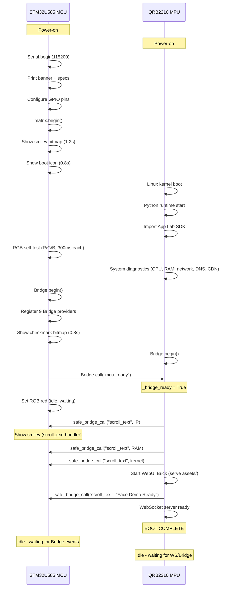

</details>

<br/>

> **Note:** The `scrollText` MCU handler currently displays `frame_smiley` rather
> than scrolling text -- text scrolling requires ArduinoGraphics font rendering
> which is not yet implemented for the Zephyr platform.

<br/>

### 2. Camera Initialization Flow

<br/>

<p align="center">
  
</p>

<details>
<summary>Diagram source (Mermaid)</summary>

```mermaid
graph TD
    A["Page Load"] --> B["navigator.mediaDevices.getUserMedia()"]
    B -->|SUCCESS| C["Got stream"]
    B -->|ERROR| D{"Check error type"}

    D -->|NotAllowedError| E["Permission denied"]
    D -->|NotFoundError| F["No camera found"]
    D -->|Other| G["Generic error message"]
    E --> H["Show camera-error overlay<br/>with fix instructions"]
    F --> H
    G --> H

    C --> I["Get track settings<br/>label, resolution, frameRate,<br/>facingMode, megapixels"]
    I --> J["cam.srcObject = stream"]
    J -->|onloadeddata| K["Init FaceLandmarker"]
    K -->|onReady| L["Start draw() render loop"]
```

</details>

<br/>

<details>
<summary><strong>3. Face Detection and Rendering Pipeline</strong></summary>

<br/>

Every animation frame passes through this pipeline. The adaptive performance
system may skip frames to maintain smooth rendering.

<br/>

<p align="center">
  
</p>

<details>
<summary>Diagram source (Mermaid)</summary>

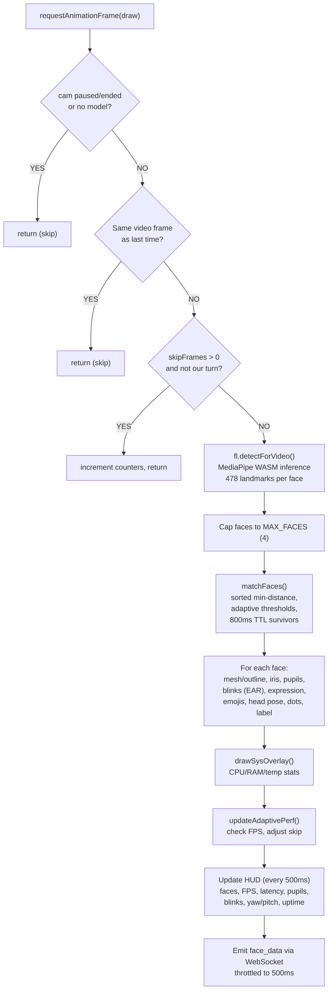

</details>

<br/>

</details>

<br/>

<details>
<summary><strong>4. Adaptive Performance State Machine</strong></summary>

<br/>

Monitors FPS over a sliding window and auto-adjusts frame skipping.
Hysteresis gap (8 to 14) prevents rapid toggling.

<br/>

<p align="center">
  
</p>

<details>
<summary>Diagram source (Mermaid)</summary>

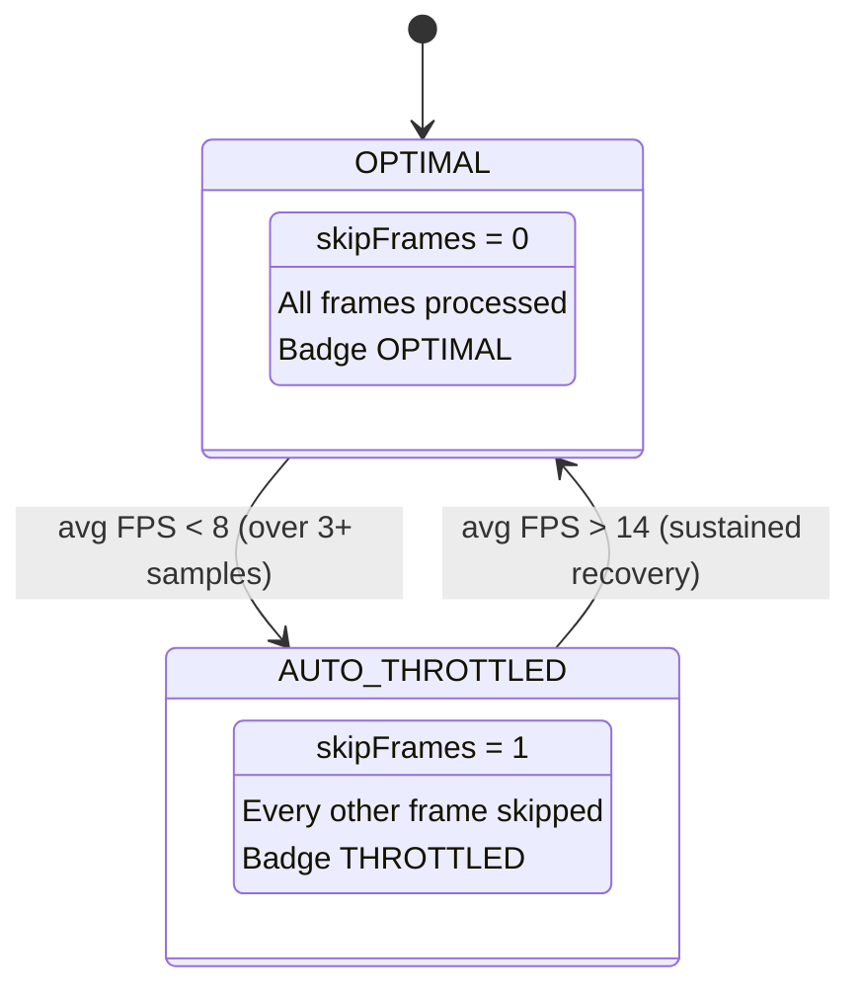

</details>

<br/>

| Parameter            | Value       |
|:---------------------|:------------|
| `lowFpsThreshold`    | 8 FPS       |
| `highFpsThreshold`   | 14 FPS      |
| `fpsWindowSize`      | 5 samples   |
| `checkInterval`      | 2000ms      |
| Min samples needed   | 3           |

<br/>

</details>

<br/>

<details>
<summary><strong>5. Face Tracking Lifecycle</strong></summary>

<br/>

Each detected face gets a persistent monotonic ID (never recycled) and a unique
color from a 4-color palette (blue, orange, green, purple).

<br/>

<p align="center">
  
</p>

<details>
<summary>Diagram source (Mermaid)</summary>

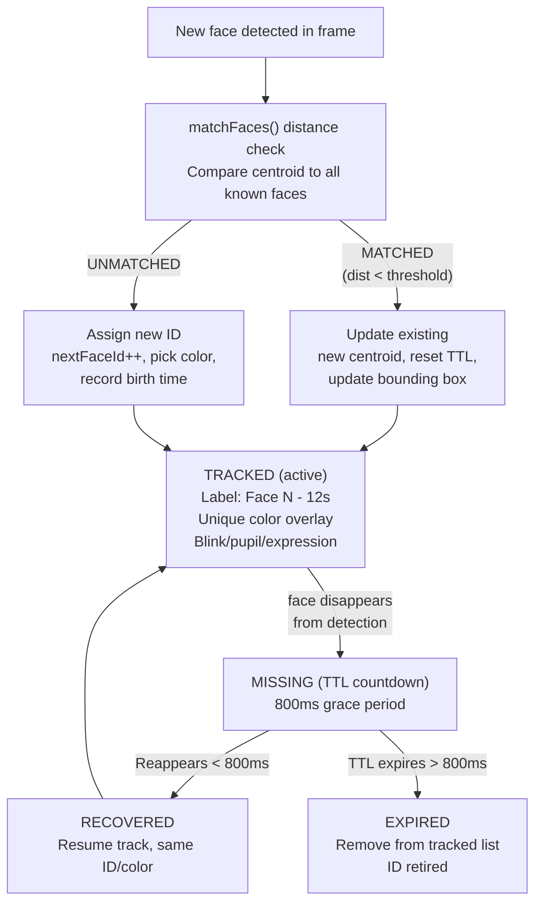

</details>

<br/>

> Distance matching uses a threshold that scales with face width, sorted by
> global minimum distance, with greedy assignment (closest pair first).
> Max tracked faces: 4 (`MAX_FACES`).

<br/>

</details>

<br/>

### 6. Bridge Communication Flow

Three layers communicate via two protocols: **WebSocket** (browser to MPU,
injected by the Brick SDK at runtime) and **Bridge RPC** (MPU to MCU).

<br/>

> **Important:** In the Replit preview, the browser runs standalone without the SDK,
> so face detection and rendering work but no data reaches the MPU or MCU.

<br/>

<p align="center">
  
</p>

<details>
<summary>Diagram source (Mermaid)</summary>

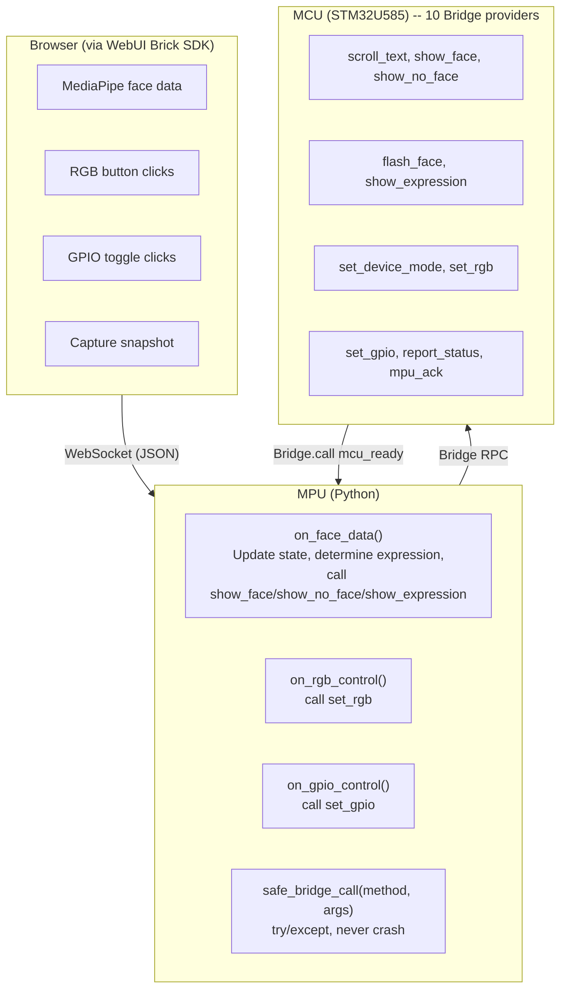

</details>

<br/>

#### MCU Bridge Providers

| Provider                  | Action                                                    |
|:--------------------------|:----------------------------------------------------------|
| **`scroll_text(text)`**   | Display `frame_smiley` (no text scroll on Zephyr)         |
| **`show_face()`**         | Smiley bitmap + green RGB + relay ON                      |
| **`show_no_face()`**      | X bitmap + red RGB + relay OFF                            |
| **`flash_face(count)`**   | Rapid flash N times + buzzer beep                         |
| **`show_expression(e)`**  | Expression bitmap + color-coded RGB                       |
| **`set_device_mode(m)`**  | Store mode string (no hardware change)                    |
| **`set_rgb(color)`**      | Set RGB LED (8 colors + off)                              |
| **`set_gpio(pin:state)`** | Toggle pin if in allowlist and enabled                    |
| **`report_status()`**     | Send uptime/faces/mode to MPU                             |
| **`mpu_ack()`**           | Acknowledge MPU handshake, stop retry loop                |

<br/>

<details>
<summary><strong>7. RGB LED State Machine</strong></summary>

<br/>

LED4 is active-low (`LOW` = ON, `HIGH` = OFF).
Supported colors: red, green, blue, yellow, cyan, magenta, white, off.

<br/>

<p align="center">
  
</p>

<details>
<summary>Diagram source (Mermaid)</summary>

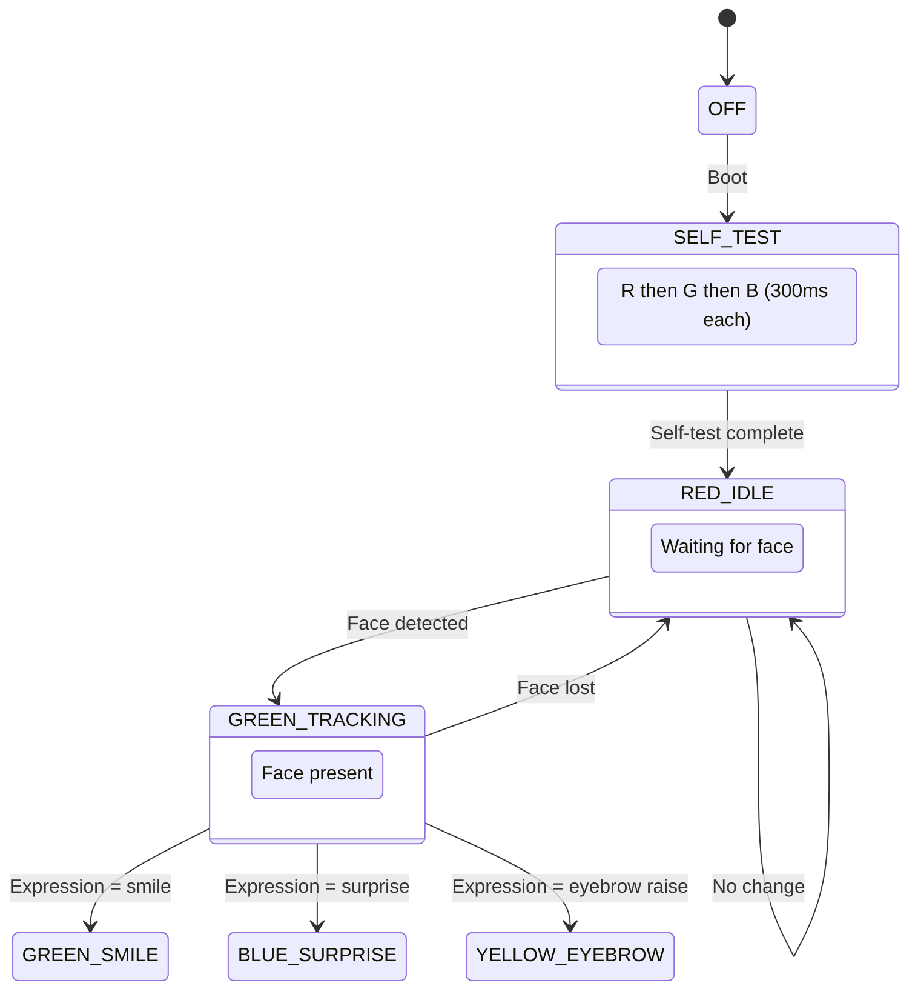

</details>

<br/>

</details>

<br/>

<details>
<summary><strong>8. Overlay Rendering Order</strong></summary>

<br/>

Each frame draws layers in a specific order. The overlay preset controls
which layers are visible.

<br/>

| Layer  | Content                           | Visibility                   |
|:-------|:----------------------------------|:-----------------------------|
| 0      | Video frame (via cam element)     | Always                       |
| 1      | Face mesh tessellation            | Toggleable                   |
| 2      | Face contour / jawline            | Toggleable                   |
| 3      | Eye outline connections           | Toggleable                   |
| 4      | Eyebrow connections               | Toggleable                   |
| 5      | Lip connections                   | Toggleable                   |
| 6      | Face oval (outer contour)         | Toggleable                   |
| 7      | Iris connections + pupil ring     | Toggleable                   |
| 8      | Iris diameter measurement         | Always (when iris visible)   |
| 9      | Landmark dots (478 per face)      | Toggleable                   |
| 10     | Emoji expression indicators       | Toggleable                   |
| 11     | Blink flash (hot pink)            | Triggered on blink           |
| 12     | Face label ("Face N -- 12s")      | Always                       |
| 13     | System stats overlay              | Always (top-right)           |
| 14     | HUD ticker                        | Always (bottom-center)       |

<br/>

**Overlay Presets:**

| Preset                  | Mesh | Outline | Eyes | Brows | Lips | Iris | Dots | Emoji |
|:------------------------|:----:|:-------:|:----:|:-----:|:----:|:----:|:----:|:-----:|
| **Full Mesh+Features**  |  Y   |    Y    |  Y   |   Y   |  Y   |  Y   |  Y   |   Y   |
| **Outline+Features**    |  -   |    Y    |  Y   |   Y   |  Y   |  Y   |  -   |   Y   |
| **Mesh Only**           |  Y   |    -    |  -   |   -   |  -   |  -   |  -   |   -   |
| **Dots Only**           |  -   |    -    |  -   |   -   |  -   |  -   |  Y   |   -   |
| **Minimal**             |  -   |    Y    |  -   |   -   |  -   |  Y   |  -   |   -   |
| **Outline+Emojis**      |  -   |    Y    |  -   |   -   |  Y   |  -   |  -   |   Y   |

<br/>

</details>

<br/>

<details>
<summary><strong>9. Delegate Selection and Validation Flow</strong></summary>

<br/>

The QRB2210's Adreno 702 GPU supports WebGL, but MediaPipe's GPU delegate
produces spatially incorrect landmarks. The app uses CPU-first with automatic
runtime validation.

<br/>

<p align="center">
  
</p>

<details>
<summary>Diagram source (Mermaid)</summary>

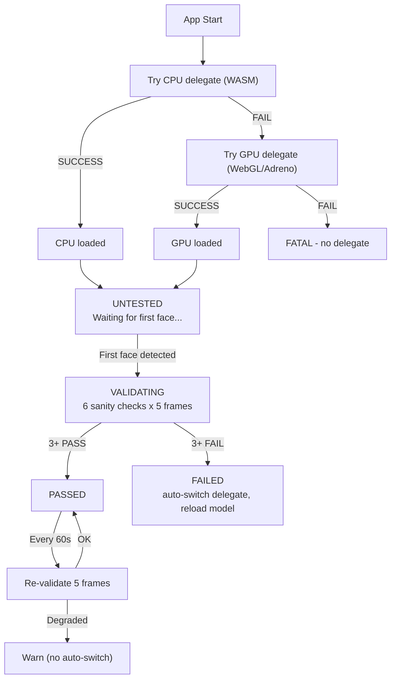

</details>

<br/>

**Sanity checks per frame:**

| Check  | Condition                    |
|:-------|:-----------------------------|
| 1      | Landmark count = 478         |
| 2      | Bounding box > 3% of frame   |
| 3      | Out-of-bounds points < 20    |
| 4      | Nose near face center        |
| 5      | Eye separation 2-50%         |
| 6      | Forehead above chin          |

<br/>

</details>

<br/>

<details>
<summary><strong>10. WebSocket Telemetry Flow</strong></summary>

<br/>

Face data flows from the browser to the MPU, which drives MCU hardware responses.

<br/>

<p align="center">
  
</p>

<details>
<summary>Diagram source (Mermaid)</summary>

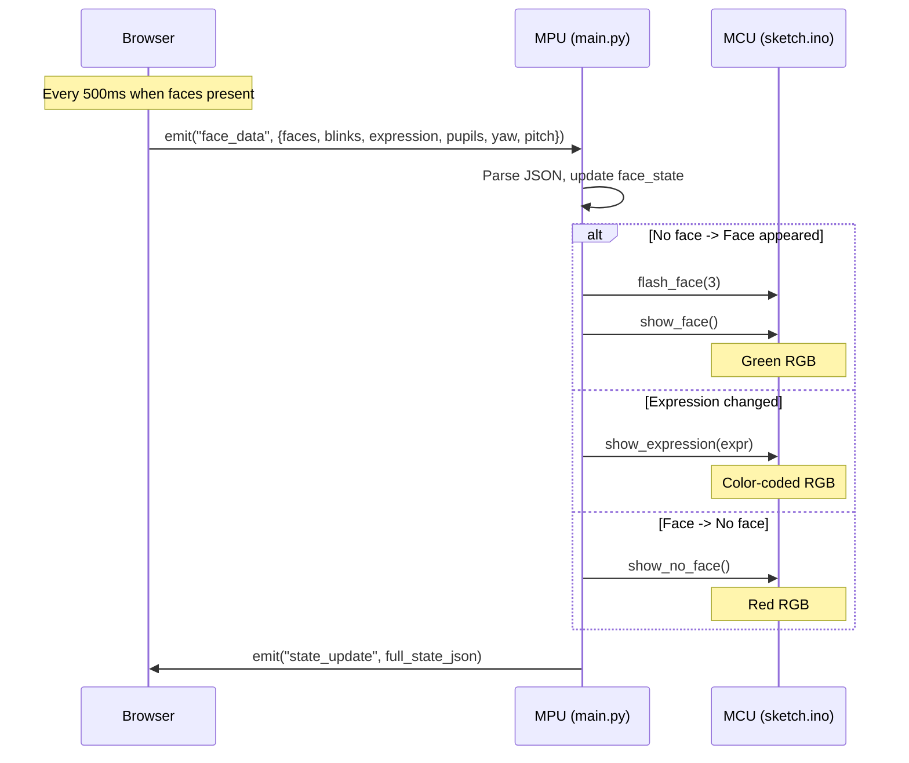

</details>

<br/>

</details>

<br/>

---

<br/>

## Performance

| Stage                                     | Typical Latency   | Bottleneck                  |
|:------------------------------------------|:------------------|:----------------------------|
| USB camera capture                        | ~67ms (15 FPS)    | UVC webcam frame rate       |
| MediaPipe WASM inference                  | ~5-15ms           | CPU (4x A53 cores)          |
| Canvas rendering (per face)               | ~1-2ms            | GPU compositing             |
| WebSocket emit (throttled)                | 500ms interval    | Intentional throttle        |
| Bridge RPC (MPU to MCU)                   | ~2-5ms            | Serial transport            |
| LED matrix update                         | <1ms              | SPI to matrix driver        |
| **Browser-side (camera to overlay)**      | **~75-90ms**      | **Camera is the ceiling**   |
| **Full loop (camera to LED)**             | **~500-575ms**    | **WebSocket throttle**      |

<br/>

> **Key insight:** Browser-side rendering runs at full frame rate -- the camera
> is the ceiling. The MCU hardware response is gated by the 500ms WebSocket
> throttle, making end-to-end latency ~500-575ms. This throttle is intentional
> to avoid flooding the Bridge RPC channel.

<br/>

The camera is the dominant bottleneck. The QRB2210's dual ISPs support up to
25 MP at 30 FPS through MIPI-CSI, but this demo uses a USB webcam at 640x480 / 15 FPS.
The [UNO Media Carrier](https://docs.arduino.cc/hardware/uno-media-carrier/) with a
MIPI-CSI camera would roughly double the frame rate.

<br/>

---

<br/>

## GPIO Placeholders

Pre-configured pins for extending the demo. All set as `OUTPUT` at boot but
remain `LOW` unless their enable flag is set to `true` in `sketch.ino`. The
MCU enforces a pin allowlist -- only D3-D7 can be toggled, and only when enabled.

<br/>

| Pin     | Name           | Default    | Use Case                                       |
|:--------|:---------------|:-----------|:-----------------------------------------------|
| **D7**  | `PIN_RELAY`    | disabled   | Modulino Relay or generic 5V relay             |
| **D6**  | `PIN_EXT_LED`  | disabled   | WS2812B NeoPixel strip data pin                |
| **D5**  | `PIN_BUZZER`   | disabled   | Piezo buzzer (beep on face detection)          |
| **D4**  | `PIN_AUX_1`    | disabled   | General-purpose (servo, sensor, Modulino)      |
| **D3**  | `PIN_AUX_2`    | disabled   | General-purpose (PWM capable)                  |

<br/>

> **How to use:**
>
> - **Enable in firmware:** Set `enableRelay = true` (etc.) in `sketch.ino`
> - **Control from Python:** `Bridge.call("set_gpio", "7:1")`
> - **Control from browser (App Lab only):** WebSocket `gpio_control` event with `{pin: 7, state: 1}`

<br/>

---

<br/>

## WebSocket Events

| Event                | Direction         | Payload                                                          |
|:---------------------|:------------------|:-----------------------------------------------------------------|
| **`face_data`**      | Browser -> MPU    | `{faces, blinks, expression, pupilL, pupilR, yaw, pitch}`       |
| **`capture_snapshot`** | Browser -> MPU  | Snapshot request                                                 |
| **`rgb_control`**    | Browser -> MPU    | `{"color": "green"}` (App Lab WebSocket only)                    |
| **`gpio_control`**   | Browser -> MPU    | `{"pin": 7, "state": 1}` (App Lab WebSocket only)               |
| **`state_update`**   | MPU -> Browser    | Full face state JSON                                             |
| **`snapshot_ack`**   | MPU -> Browser    | `{"status": "ok", "timestamp": "..."}`                           |
| **`mpu_face_data`**  | MPU -> Browser    | `{faces, source:"mpu", inference_ms, detections}` (AI Hub)      |
| **`ai_status`**      | MPU -> Browser    | `{available, status, model, running, fps, inference_ms}`         |
| **`ai_toggle`**      | Browser -> MPU    | `{enable: true/false}` (start/stop on-device detection)          |

<br/>

---

<br/>

## Dependencies

Designed to pull as few external resources as possible.

<br/>

### MCU (`sketch.ino`)

| Library                    | Version      | Notes                                         |
|:---------------------------|:-------------|:----------------------------------------------|
| **Arduino_RouterBridge**   | 0.4.1        | Bridge RPC (primary dep in `sketch.yaml`)     |
| Arduino_RPClite            | 0.2.1        | Transitive dep of RouterBridge                |
| ArxContainer               | 0.7.0        | Transitive dep of RouterBridge                |
| ArxTypeTraits              | 0.3.2        | Transitive dep of RouterBridge                |
| DebugLog                   | 0.8.4        | Transitive dep of RouterBridge                |
| MsgPack                    | 0.4.2        | Transitive dep of RouterBridge                |
| **Arduino_LED_Matrix**     | (platform)   | Bundled with `arduino:zephyr` board core      |

<br/>

### MPU (`python/main.py`)

App Lab SDK (`arduino.app_utils`, `arduino.app_bricks.web_ui`) + Python stdlib.

**Optional** for on-device AI: `tflite-runtime`, `numpy`, `opencv-python-headless`.

For model compilation on a dev machine (not the Uno Q): `qai-hub`, `qai_hub_models`, `torch`.

<br/>

### Browser (`assets/index.html`)

| Resource                                  | CDN                    | Pinned       | Required                              |
|:------------------------------------------|:-----------------------|:-------------|:--------------------------------------|
| **@mediapipe/tasks-vision**               | jsdelivr               | 0.10.3       | Yes                                   |
| **face_landmarker.task model**            | Google Cloud Storage   | float16/1    | Yes (~4MB, cached after first load)   |
| Google Fonts (Inter, JetBrains Mono)      | Google Fonts           | latest       | No (degrades to system fonts)         |

<br/>

---

<br/>

## Advanced Topics

<details>
<summary><strong>Beyond Face Tracking: Industrial and Pro Applications</strong></summary>

<br/>

This demo is a proof-of-concept, but the pattern it demonstrates -- AI inference
feeding into a Python coordinator on Debian, which drives real-time MCU actuation
via Bridge RPC -- applies directly to [Arduino Pro](https://www.arduino.cc/pro/)
industrial use cases.

<br/>

| Application                  | How It Works With This Architecture                                                                                  |
|:-----------------------------|:---------------------------------------------------------------------------------------------------------------------|
| **Access control**           | Replace LED feedback with a relay on D7 for a door strike. `show_face()` = relay HIGH, `show_no_face()` = relay OFF  |
| **Occupancy monitoring**     | Use persistent face count (`MAX_FACES = 4`) and tracking lifecycle. Forward count to BMS via Wi-Fi                   |
| **Safety compliance**        | Swap MediaPipe for `arduino:object_detection` Brick (YOLOX-Nano). Detect PPE/hard hats. Buzzer on D5 for alerts     |
| **Quality inspection**       | Mount MIPI-CSI camera via Media Carrier. Vision model + Python classification + MCU GPIO for reject actuators        |
| **Operator presence**        | Face tracking 800ms TTL as presence signal. Wire D7 to safety interlock relay. MCU at Zephyr real-time priority      |
| **Retail analytics**         | Count foot traffic, measure dwell time via persistent face IDs. Forward to Arduino Cloud dashboards                  |
| **Agriculture**              | Replace camera AI with sensor Bricks (Modulino Movement, Distance). MCU drives pumps, valves, alerts via GPIO       |

<br/>

</details>

<br/>

<details>
<summary><strong>The App Lab and Bricks Experience</strong></summary>

<br/>

The [Arduino App Lab](https://docs.arduino.cc/software/app-lab/) is a unified development
environment that lets you combine Arduino sketches, Python scripts, and containerized
Linux applications into a single workflow.

<br/>

<p align="center">
  
</p>

<br/>

[Bricks](https://docs.arduino.cc/software/app-lab/tutorials/bricks) are code building
blocks that abstract away complexity. This project uses a single Brick:

- **`arduino:web_ui`** -- serves the contents of `assets/` as a web application and
  provides WebSocket messaging between the browser and `python/main.py`. The Brick
  injects WebSocket connectivity at runtime. No explicit socket code is needed in the HTML.

<br/>

<p align="center">
  
</p>

<br/>

> **Tip:** To install this demo, download the repository as a `.zip`, open
> [Arduino App Lab](https://www.arduino.cc/en/software/#app-lab-section),
> click **Import App**, and select the file.

<br/>

</details>

<br/>

<details>
<summary><strong>Expanding the Hardware</strong></summary>

<br/>

The Uno Q retains the classic UNO form factor for shield compatibility, and adds
two bottom-mounted high-speed connectors (JMEDIA and JMISC) for advanced peripherals.

<br/>

<p align="center">
  
</p>

<br/>

**Carrier boards:**

| Carrier                                                                             | What It Adds                                                                                          |
|:------------------------------------------------------------------------------------|:------------------------------------------------------------------------------------------------------|
| [**UNO Media Carrier**](https://docs.arduino.cc/hardware/uno-media-carrier/)        | Dual MIPI-CSI camera connectors (RPi compatible), MIPI-DSI display output, three 3.5 mm audio jacks  |
| [**UNO Breakout Carrier**](https://docs.arduino.cc/hardware/uno-breakout-carrier/)  | Full breakout of JMEDIA/JMISC signals to 2.54 mm headers -- audio, I2C, SPI, UART, PWM, PSSI, GPIO   |

<br/>

**Qwiic / Modulino sensors** (no soldering, I2C on Wire1):

| Modulino                                                                              | Use With This Demo                                                           |
|:--------------------------------------------------------------------------------------|:-----------------------------------------------------------------------------|
| [**Modulino Movement**](https://docs.arduino.cc/hardware/modulino-movement/)          | LSM6DSOX accelerometer/gyroscope -- detect tilt/movement while tracking      |
| [**Modulino Distance**](https://docs.arduino.cc/hardware/modulino-distance/)          | Time-of-flight -- measure viewer distance from camera                        |
| [**Modulino Buttons**](https://docs.arduino.cc/hardware/modulino-buttons/)            | Physical buttons -- cycle overlay presets or toggle tracking                  |

<br/>

</details>

<br/>

<details>
<summary><strong>Arduino Cloud Integration (Future)</strong></summary>

<br/>

The current demo runs entirely on the local network.
[Arduino Cloud](https://docs.arduino.cc/arduino-cloud/) could add:

- Log timestamp and screenshot of each new face detection to a cloud Thing
- Persistent face count across sessions (daily/weekly)
- Live dashboard showing tracking state, uptime, and system health remotely
- Webhook notifications when a face is detected (or absent for a threshold period)
- Historical data export via [Arduino Cloud's built-in data export](https://docs.arduino.cc/arduino-cloud/features/iot-cloud-historical-data/)

<br/>

> The Uno Q's built-in Wi-Fi and the WebUI Brick's `web_ui.expose_api()` pattern
> make this feasible without restructuring the app.

<br/>

</details>

<br/>

<details>
<summary><strong>Advanced AI Model Options</strong></summary>

<br/>

> **Warning:** The sections below describe AI model workflows that are technically
> possible on the Uno Q's QRB2210 but are **not part of this demo** and **not included
> in the App Lab zip**. They require additional software (`tflite-runtime`, OpenCV,
> numpy), a camera on the MPU, and in some cases cloud accounts.

<br/>

#### What is Qualcomm AI Hub?

[Qualcomm AI Hub](https://aihub.qualcomm.com/) takes pre-trained AI models (PyTorch,
ONNX, TensorFlow) and compiles them into optimized runtimes for specific Qualcomm chipsets.

<br/>

<p align="center">
  
</p>

<details>
<summary>Diagram source (Mermaid)</summary>

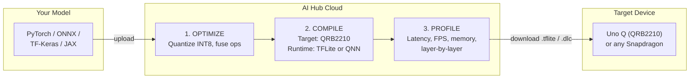

</details>

<br/>

#### On-Device Inference via AI Hub

The `python/face_detector_mpu.py` module implements an alternative path: face detection
runs natively on the QRB2210 using `tflite-runtime`, bypassing the browser.

<br/>

<p align="center">
  
</p>

<details>
<summary>Diagram source (Mermaid)</summary>

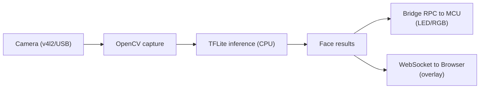

</details>

<br/>

**TFLite delegates on QRB2210:**

<br/>

<p align="center">
  
</p>

<br/>

<p align="center">
  
</p>

<details>
<summary>Diagram source (Mermaid)</summary>

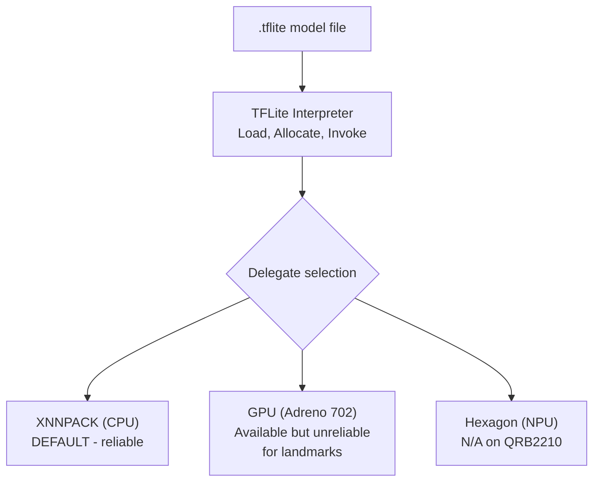

</details>

<br/>

**Hardware constraints on the QRB2210:**

| Spec         | Value                                | Impact                                                         |
|:-------------|:-------------------------------------|:---------------------------------------------------------------|
| **CPU**      | Cortex-A53 @ 2.0 GHz (4 cores)      | TFLite runs here. INT8 face_det_lite: ~5-15ms/frame            |
| **GPU**      | Adreno 702 @ 845 MHz                | GPU delegate available but slower for small models             |
| **NPU/TPU**  | None (0 TOPS)                        | No hardware neural network accelerator                         |
| **Camera**   | USB (UVC) or MIPI-CSI via Carrier    | 640x480 @ 15 FPS ceiling for USB                               |
| **RAM**      | 2 GB or 4 GB LPDDR4                 | Model + OpenCV + TFLite uses ~80-120 MB                        |

<br/>

**Setup:**

```bash
# On your dev machine -- compile model for QRB2210 via AI Hub cloud
pip install qai-hub qai_hub_models torch
qai-hub configure --api_token YOUR_TOKEN
python python/ai_hub_setup.py --compile --model face_det_lite --device QRB2210

# Copy the .tflite file to the Uno Q
scp python/models/face_det_lite.tflite unoq:~/face-demo/python/models/

# On the Uno Q -- install runtime deps
pip install tflite-runtime numpy opencv-python-headless

# Reboot the app -- it auto-discovers .tflite files in python/models/ at boot
```

<br/>

> **Tip:** The system always works without AI Hub models. Missing dependencies
> result in graceful fallback to browser-only mode (MediaPipe WASM).

<br/>

**Inference Approaches Comparison:**

| Approach                         | In This Demo?  | Where It Runs          | Setup Effort                          | Best For                               |
|:---------------------------------|:--------------:|:-----------------------|:--------------------------------------|:---------------------------------------|
| **Browser (MediaPipe WASM)**     | **Yes**        | Client browser         | Zero -- loads from CDN                | Demos, face landmarks (this demo)      |
| **App Lab Brick**                | Partially      | QRB2210 Docker         | Low -- add one line to `app.yaml`     | Standard tasks (object detection)      |
| AI Hub TFLite                    | No             | QRB2210 MPU native     | Medium -- compile + install deps      | Optimized headless inference           |
| Hugging Face model               | No             | QRB2210 MPU native     | Medium-High -- export to TFLite       | Research models, niche tasks           |
| Custom model (Edge Impulse)      | No             | QRB2210 MPU native     | High -- train + export + deploy       | Domain-specific, proprietary data      |

<br/>

#### Bringing a Hugging Face Model

Models on [Hugging Face Hub](https://huggingface.co/) that can be exported to TFLite
format can run on the Uno Q using the same `tflite-runtime` infrastructure.

<br/>

<p align="center">
  
</p>

<details>
<summary>Diagram source (Mermaid)</summary>

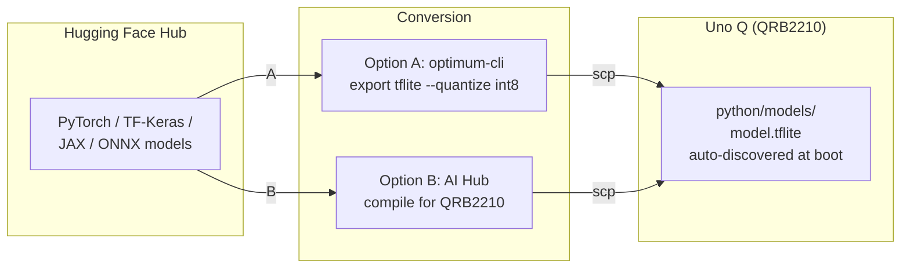

</details>

<br/>

1. **Export to TFLite** via `optimum-cli export tflite --model google/vit-base-patch16-224 --quantize int8`
2. **Drop the `.tflite` into `python/models/`** -- modify `face_detector_mpu.py` to match input/output signatures if different
3. **Run inference** -- the same `tflite-runtime` runs any valid TFLite model

<br/>

> **Tip:** Stick to mobile-optimized architectures (MobileNetV2/V3, EfficientNet-Lite,
> NanoDet, PicoDet). Models under 5M parameters with 320x320 input run comfortably
> on the A53 cores.

<br/>

#### Bringing a Custom Edge Impulse Model

[Edge Impulse](https://edgeimpulse.com/) trains custom ML models on your own data.
Models trained there export as TFLite and run on the Uno Q identically to AI Hub models.

<br/>

<p align="center">
  
</p>

<details>
<summary>Diagram source (Mermaid)</summary>

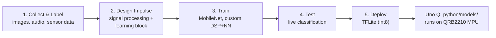

</details>

<br/>

> **Note:** Edge Impulse also has a direct Arduino library export (C++), but that targets
> the STM32 MCU which is too constrained for most ML models (Cortex-M33, 786 KB SRAM).
> Use the TFLite export to the MPU side instead.

<br/>

#### AI Model Ecosystem for Uno Q

<br/>

<p align="center">
  
</p>

<details>
<summary>Diagram source (Mermaid)</summary>

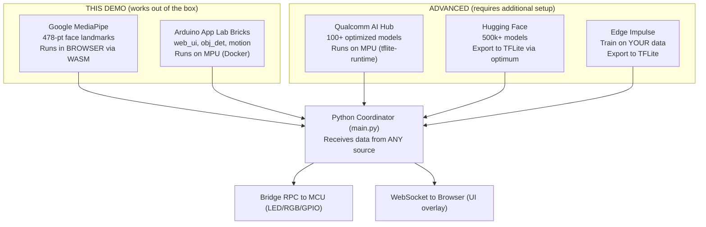

</details>

<br/>

#### The Decision Tree

<br/>

<p align="center">
  
</p>

<details>
<summary>Diagram source (Mermaid)</summary>

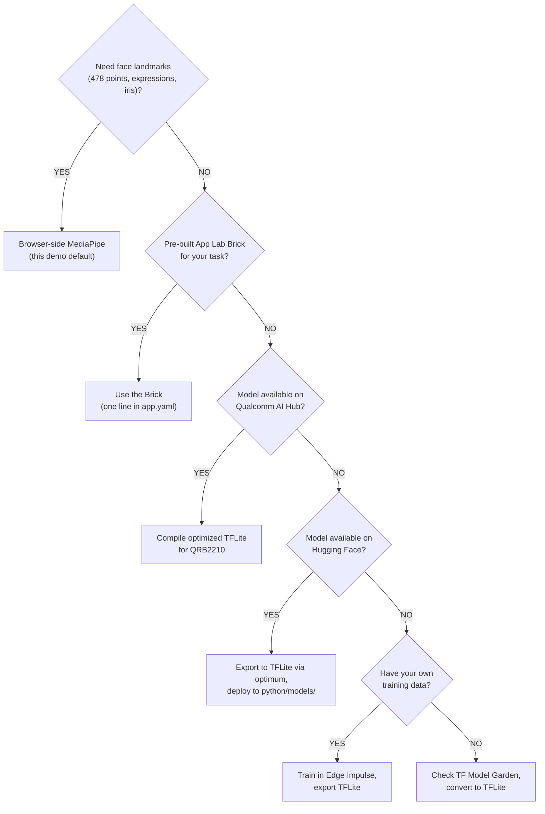

</details>

<br/>

> In all cases, the MCU layer, Bridge providers, WebSocket events, and Python
> coordinator remain the same. **Only the inference source changes.**

<br/>

</details>

<br/>

<details>
<summary><strong>Where the Uno Q Fits in Qualcomm's World</strong></summary>

<br/>

> **Context:** The material below is background reading about Qualcomm's product
> ecosystem, the upcoming Ventuno Q, and industry trends. None of it is required
> to use this demo.

<br/>

#### Qualcomm Dragonwing IoT Processor Lineup

The QRB2210 is Qualcomm's entry-tier IoT processor:

<br/>

| Feature            | QRB2210 (Uno Q)                    | QCS6490                               | QCS8550                              |
|:-------------------|:-----------------------------------|:---------------------------------------|:-------------------------------------|
| **Series**         | Q2 (Dragonwing)                    | Q6 (Dragonwing)                        | Q8 (Dragonwing)                      |
| **CPU**            | 4x Cortex-A53 @ 2.0 GHz           | Kryo 670 (big.LITTLE)                  | Kryo (big.LITTLE)                    |
| **GPU**            | Adreno 702                         | Adreno 643                             | Adreno 740                           |
| **NPU**            | None (0 TOPS)                      | Hexagon DSP + HTA (~12 TOPS)           | Hexagon NPU (~48 TOPS)              |
| **RAM**            | 2-4 GB LPDDR4                      | Up to 8 GB LPDDR4X                     | Up to 16 GB LPDDR5X                  |
| **AI inference**   | CPU/GPU TFLite only                | NPU-accelerated (QNN, SNPE)            | NPU-accelerated (QNN)               |
| **Use case**       | Entry IoT, prototyping, education  | Mid-tier edge AI, smart cameras        | High-end edge AI, robotics          |
| **Approx. cost**   | ~$25                               | ~$80                                   | ~$150+                               |

<br/>

> _QCS6490 and QCS8550 specs are approximate. Consult
> [Qualcomm's product pages](https://www.qualcomm.com/products/technology/processors)
> for exact specifications._

<br/>

#### Uno Q vs Ventuno Q

Qualcomm announced its intent to acquire Arduino in October 2025. The combined
entity is executing a two-board hardware strategy:

<br/>

| Spec            | Arduino Uno Q (Shipping Now)                  | Arduino Ventuno Q (Announced EW 2026)         |
|:----------------|:----------------------------------------------|:----------------------------------------------|
| **MPU**         | Qualcomm QRB2210 (Q2 Series)                  | Qualcomm Dragonwing IQ8 (IQ-8275)             |
| **CPU**         | 4x Cortex-A53 @ 2.0 GHz                      | 8-core Kryo (up to ~2.4 GHz)                  |
| **GPU**         | Adreno 702                                    | Adreno                                        |
| **NPU**         | None (0 TOPS)                                 | Hexagon Tensor (~40 TOPS)                     |
| **RAM**         | 2-4 GB LPDDR4                                 | 16 GB LPDDR5                                  |
| **Storage**     | 16-64 GB eMMC                                 | 64 GB eMMC + M.2 NVMe                         |
| **MCU**         | STM32U585 (Cortex-M33, 786 KB SRAM)           | STM32H5F5 (Cortex-M33, higher SRAM)           |
| **OS**          | Debian Linux + Zephyr                         | Ubuntu/Debian + Zephyr                        |
| **Price**       | ~$90 (4 GB)                                   | ~$300 (expected)                               |
| **Best for**    | Learning, prototyping, IoT gateways           | On-device LLMs, NPU vision, robotics          |

<br/>

Both boards share: dual-brain architecture (MPU + MCU via Bridge), App Lab + Bricks
ecosystem, Arduino IDE/Cloud compatibility, Python (MPU) + C++ Sketch (MCU) programming
model, and the same Bridge API pattern.

<br/>

> _Ventuno Q specs are based on the Embedded World 2026 announcement and may change._

<br/>

#### Qualcomm's Full-Stack Edge AI Ecosystem

Assembled through acquisitions (2024-2025):

<br/>

<p align="center">
  
</p>

<details>
<summary>Diagram source (Mermaid)</summary>

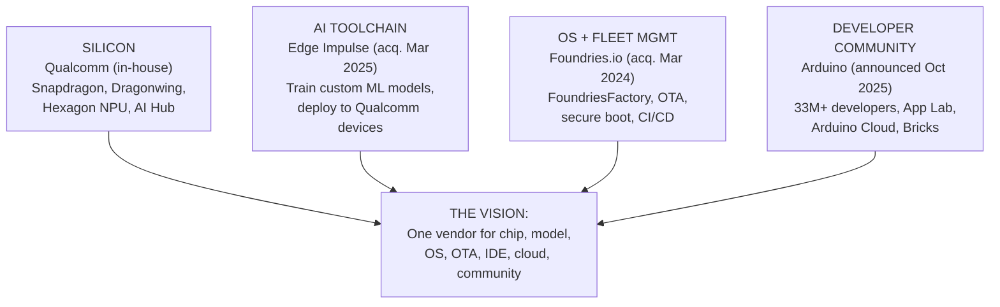

</details>

<br/>

| Stage              | Tool                                  | What It Does                                       |
|:-------------------|:--------------------------------------|:---------------------------------------------------|
| **Prototype**      | Arduino IDE / App Lab                 | Write sketch + Python, test on single board        |
| **Train AI**       | Edge Impulse                          | Train custom model on your data, export TFLite     |
| **Optimize**       | AI Hub                                | Compile + quantize model for QRB2210 or IQ8        |
| **Secure OS**      | FoundriesFactory                      | Hardened Linux, secure boot, container isolation   |
| **Deploy fleet**   | FoundriesFactory + Arduino Cloud      | OTA updates to 10 or 10,000 boards                 |
| **Monitor**        | Arduino Cloud                         | Dashboard, alerts, remote management               |

<br/>

#### Qualcomm Physical AI Stack

<br/>

<p align="center">
  
</p>

<details>
<summary>Diagram source (Mermaid)</summary>

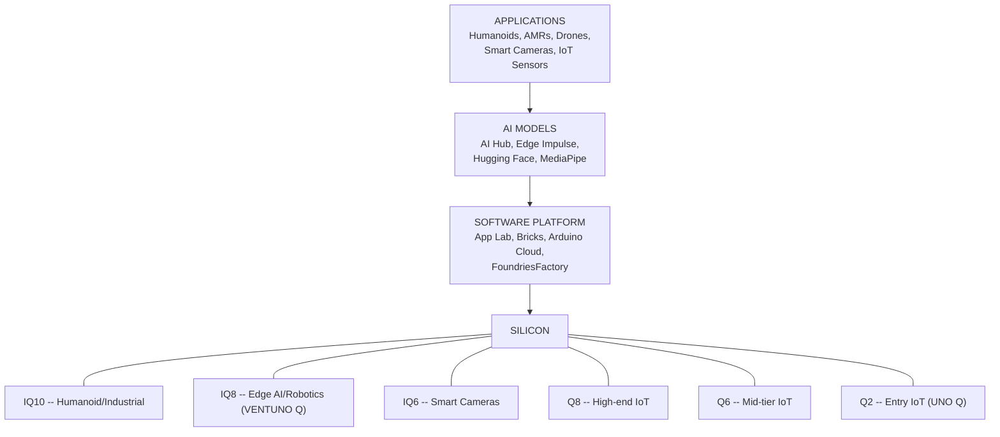

</details>

<br/>

> The face detection demo running on this Uno Q is a small example of this larger arc.
> The same architectural pattern -- camera input, AI inference, Bridge to MCU, real-time
> actuation -- is how a warehouse robot processes its environment, how a smart camera
> identifies defects, and how a drone navigates autonomously. The Uno Q teaches the
> pattern at an accessible price point.

<br/>

</details>

<br/>

---

<br/>

## Links & Resources

**Arduino Hardware & Software**

| Resource                    | Link                                                                                               |
|:----------------------------|:---------------------------------------------------------------------------------------------------|
| Arduino Uno Q Hardware      | [docs.arduino.cc/hardware/uno-q/](https://docs.arduino.cc/hardware/uno-q/)                         |
| UNO Q User Manual           | [docs.arduino.cc/tutorials/uno-q/user-manual/](https://docs.arduino.cc/tutorials/uno-q/user-manual/) |
| UNO Q Pinout (PDF)          | [ABX00162-full-pinout.pdf](https://docs.arduino.cc/resources/pinouts/ABX00162-full-pinout.pdf)      |
| UNO Q Datasheet (PDF)       | [ABX00162-ABX00173-datasheet.pdf](https://docs.arduino.cc/resources/datasheets/ABX00162-ABX00173-datasheet.pdf) |
| Arduino App Lab             | [docs.arduino.cc/software/app-lab/](https://docs.arduino.cc/software/app-lab/)                     |
| App Lab Bricks              | [docs.arduino.cc/software/app-lab/tutorials/bricks](https://docs.arduino.cc/software/app-lab/tutorials/bricks) |
| Arduino Cloud               | [docs.arduino.cc/arduino-cloud/](https://docs.arduino.cc/arduino-cloud/)                           |
| Buy Arduino Uno Q           | [store.arduino.cc/pages/uno-q](https://store.arduino.cc/pages/uno-q)                               |

<br/>

**AI & ML Platforms**

| Resource                          | Link                                                                                                        |
|:----------------------------------|:------------------------------------------------------------------------------------------------------------|
| Google MediaPipe Face Landmarker  | [ai.google.dev/edge/mediapipe](https://ai.google.dev/edge/mediapipe/solutions/vision/face_landmarker)       |
| Qualcomm AI Hub                   | [aihub.qualcomm.com](https://aihub.qualcomm.com/)                                                          |
| Qualcomm AI Hub Models            | [aihub.qualcomm.com/models](https://aihub.qualcomm.com/models)                                              |
| Edge Impulse                      | [edgeimpulse.com](https://edgeimpulse.com/)                                                                 |
| Hugging Face Hub                  | [huggingface.co/models](https://huggingface.co/models)                                                      |
| TensorFlow Lite Model Garden      | [tensorflow.org/lite/models](https://www.tensorflow.org/lite/models)                                         |

<br/>

**Qualcomm & Industry**

| Resource                           | Link                                                                                                       |
|:-----------------------------------|:-----------------------------------------------------------------------------------------------------------|
| Qualcomm Dragonwing Platform       | [qualcomm.com/products/technology/processors](https://www.qualcomm.com/products/technology/processors)      |
| Foundries.io / FoundriesFactory    | [foundries.io](https://foundries.io/)                                                                      |
| Arduino Ventuno Q (EW 2026)        | [blog.arduino.cc](https://blog.arduino.cc/)                                                                |

<br/>

---

<br/>

## Contributing

Contributions are welcome. If you find a bug, have a feature request, or want
to improve the documentation:

1. **Fork** this repository
2. **Create a branch** for your feature or fix (`git checkout -b feature/my-feature`)
3. **Commit** your changes with clear messages
4. **Push** to your fork and open a **Pull Request**

<br/>

> **Guideline:** Keep the architecture modular -- the inference source should remain
> swappable, and the MCU layer should stay event-driven.

<br/>

---

<br/>

## License

This project is licensed under the **MIT License** -- see the [LICENSE](LICENSE) file for details.

<br/>

---

<div align="center">

<br/>

**Built for the [Arduino Uno Q](https://store.arduino.cc/pages/uno-q/)**

**Qualcomm QRB2210 + STM32U585**

<br/>

*The inference source is swappable. The architecture is the showcase.*

<br/>

</div>
